# **CSS Basics**

<br/>

## Table of Contents

* [CSS Coding Practice](css-practice.md)
* [CSS3 Properties](css3-properties.md)
* [SCSS Basics](https://github.com/learning-zone/scss-basics)
* [CSS Multiple Choice Questions](css-multiple-choice-questions.md)

<br/>

## Q. CSS là gì?

**CSS** là viết tắt của **Cascading Style Sheets**. CSS được sử dụng để định dạng các trang web, bao gồm thiết kế, bố cục và cách hiển thị trên các thiết bị và kích thước màn hình khác nhau. CSS nhằm mục đích cho phép các nhà phát triển web tách nội dung và cấu trúc của trang web khỏi thiết kế trực quan.

CSS có thể được sử dụng để định dạng văn bản trên trang web - **Ví dụ:** như thay đổi màu sắc và kích thước của tiêu đề và liên kết. 

Nó cũng có thể được sử dụng để tạo bố cục trang web - **Ví dụ:** biến một cột văn bản thành bố cục với khu vực nội dung chính và thanh bên để biết thông tin liên quan. CSS thậm chí có thể được sử dụng để tạo các hiệu ứng như hoạt hình.

**Example:**

```css
h1 {
  color: red;
  font-size: 5em;
}

p {
  color: black;
}
```

<div align="right">
    <b><a href="#">↥ back to top</a></b>
</div>

## Q. Bộ quy tắc CSS

CSS là một **quy tắc** hoặc **bộ quy tắc** mô tả định dạng (thay đổi hình thức) của các thành phần riêng lẻ trên một trang web. 

**Quy tắc bao gồm hai phần:** bộ chọn và khối khai báo tiếp theo. Hình ảnh bên dưới thể hiện cấu trúc (cú pháp) của quy tắc:

```css
div {
  color: blue;
  text-align: justify;
}
```

<p align="center">
  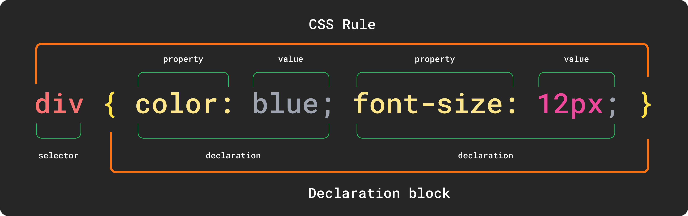
</p>

* Đầu tiên luôn là **bộ chọn (Selector)**, nó cho trình duyệt biết thành phần nào hoặc các thành phần của trang web sẽ được tạo kiểu.
* Tiếp theo là **khối khai báo (Declaration block)**, bắt đầu bằng dấu ngoặc nhọn mở `{`, kết thúc bằng dấu đóng `}`, giữa các dấu ngoặc nhọn là các lệnh định dạng (khai báo) được chỉ định, được trình duyệt sử dụng để tạo kiểu cho phần tử bộ chọn đã chọn.
* Mỗi **khai báo (Declaration)** bao gồm hai phần: thuộc tính và giá trị của nó. Phần khai báo phải luôn kết thúc bằng dấu chấm phẩy (;). Bạn có thể bỏ qua ; chỉ ở cuối phần khai báo cuối cùng trước dấu ngoặc nhọn đóng.
* **thuộc tính (Property)** là lệnh định dạng xác định hiệu ứng kiểu cụ thể cho một phần tử. Mỗi thuộc tính có tập hợp giá trị được xác định trước của riêng nó. Sau tên thuộc tính, dấu hai chấm được chỉ định để phân tách tên thuộc tính khỏi giá trị hợp lệ.

<div align="right">
    <b><a href="#">↥ back to top</a></b>
</div>

## Q. Những cách có thể áp dụng kiểu CSS cho một trang web là gì?

Có ba cách để áp dụng CSS vào HTML: Inline, internal, and external.

**1. Inline CSS:**

CSS nội tuyến được chỉ định trực tiếp trong thẻ mở của phần tử mà bạn muốn áp dụng. Nó được nhập vào thuộc tính style trong HTML. Điều này cho phép áp dụng các thuộc tính CSS trên cơ sở mỗi phần tử.

**Example:**

```html
<p style="font-weight:bold;">Bold Font</p>
```

Loại CSS này không thực sự được khuyến khích vì mỗi thẻ HTML cần được tạo kiểu riêng. Tuy nhiên, CSS nội tuyến có thể hữu ích trong một số trường hợp, chẳng hạn như:

* Khi bạn cần áp dụng kiểu cho một phần tử duy nhất.
* Khi bạn đang phát triển một trang web tạm thời hoặc chưa hoàn thiện.
* Khi bạn không có quyền truy cập vào tệp CSS.

**2. Internal CSS:**

Kiểu nội bộ hoặc nhúng được áp dụng cho toàn bộ trang. Bên trong phần tử `head`, các thẻ kiểu bao gồm tất cả các kiểu của trang.

**Example:**

```html
<!DOCTYPE html>
<html>
  <head>
    <title>Internal CSS Example</title>
  <style>
    p {
        color: red;
    }
    
    a {
        color: blue;
    }
</style>
...
```

Kiểu CSS này là một phương pháp hiệu quả để tạo kiểu cho một trang. Tuy nhiên, việc sử dụng kiểu này cho nhiều trang sẽ tốn thời gian vì bạn cần đặt các quy tắc CSS cho từng trang trên trang web của mình.

**3. External CSS:**

Trong các quy tắc CSS bên ngoài được lưu trữ trong một tệp riêng biệt. Để tham chiếu đến tệp đó từ trang HTML, hãy thêm phần tử liên kết vào phần tử head. Loại CSS này là một phương pháp hiệu quả hơn, đặc biệt là để tạo kiểu cho một trang web lớn. Bằng cách chỉnh sửa một tệp `.css`, bạn có thể thay đổi toàn bộ trang web của mình cùng một lúc.

`style.css`

```css
  p {
      color: red;
  }
  
  a {
      color: blue;
  }
```

```html
<!DOCTYPE html>
<html>
<head>
    <title>External CSS Example</title>
    <link rel="stylesheet" type="text/css" href="style.css">
...
```

Phần tử liên kết trong ví dụ có ba thuộc tính. Đầu tiên, `rel` cho trình duyệt biết loại mục tiêu của liên kết. Thứ hai, `type` cho trình duyệt biết đó là loại biểu định kiểu nào. Và thứ ba, `href` cho trình duyệt biết URL của biểu định kiểu cần tìm.

<div align="right">
    <b><a href="#">↥ back to top</a></b>
</div>

## Q. Phần xếp tầng của CSS có ý nghĩa gì?

**Cascading (Xếp tầng)** trong CSS đề cập đến thực tế là các quy tắc tạo kiểu "Cascading" từ nhiều nguồn. Điều này có nghĩa là CSS có hệ thống phân cấp vốn có, trong đó các kiểu có mức độ ưu tiên cao hơn sẽ ghi đè lên các kiểu có mức độ ưu tiên thấp hơn.

Ngay cả tài liệu HTML đơn giản nhất cũng có thể có ba hoặc nhiều biểu định kiểu được liên kết với nó, bao gồm:

* Bảng định kiểu của **trình duyệt**
* Bảng định kiểu của **người dùng**
* Bảng định kiểu của **tác giả**

**1. Bảng định kiểu của trình duyệt:**

Trình duyệt áp dụng các kiểu cho tất cả các tài liệu web. Mặc dù các kiểu này có thể khác nhau giữa các trình duyệt, nhưng chúng đều có một số điểm chung, chẳng hạn như văn bản màu đen, liên kết màu xanh lam và liên kết đã truy cập màu tím. Các kiểu này được gọi là kiểu trình duyệt "mặc định".

Ngay khi bạn, tác giả, áp dụng biểu định kiểu cho tài liệu, nó sẽ ghi đè biểu định kiểu của trình duyệt. Điều này là do các biểu định kiểu của tác giả được ưu tiên hơn các biểu định kiểu của trình duyệt.

**2. Bảng định kiểu của người dùng:**

Hầu hết các trình duyệt hiện đại đều cho phép người dùng thiết lập các biểu định kiểu của riêng họ trong trình duyệt của họ. Các biểu định kiểu này sẽ ghi đè các biểu định kiểu mặc định của trình duyệt - chỉ dành cho người dùng đó.

**3. Bảng định kiểu của tác giả:**

Ngay khi bạn áp dụng một biểu định kiểu cơ bản hoặc một kiểu nội tuyến cho một trang, bạn đã thêm cái được gọi là "biểu định kiểu tác giả". Mọi thứ bạn làm trong CSS, từ việc chọn phông chữ, màu sắc và bố cục trang, đều được thực hiện bằng cách sử dụng các biểu định kiểu của tác giả.


<div align="right">
    <b><a href="#">↥ back to top</a></b>
</div>

## Q. Giải thích các tính năng mới trong CSS3?

**1. CSS3 Selectors:**

Khớp với bất kỳ phần tử `E` nào có thuộc tính `attr` bắt đầu bằng giá trị `val`. Nói cách khác, `val` khớp với một phần của giá trị thuộc tính.

Ví dụ: giả sử bạn có một tệp HTML có chứa các phần tử sau:

```css
E[attr^=val]
/* Example */
a[href^='http://sales.']{color: teal;}
```

```html
<a href="http://sales.example.com">Sales</a>
<a href="http://support.example.com">Support</a>
```

Nếu bạn có quy tắc CSS sau:

```css
a[href^='http://sales.'] {
  color: teal;
}
```

Thì chỉ phần tử a đầu tiên sẽ được tô màu teal, vì chỉ phần tử này có thuộc tính href bắt đầu bằng `"http://sales."`.

<hr>
<br>

Khớp với bất kỳ phần tử `E` nào có thuộc tính `attr` kết thúc bằng `val`. Nói cách khác, `val` khớp với một phần của giá trị thuộc tính.

```css
E[attr$=val]
/* Example */
a[href$='.jsp']{color: purple;}
```

Ví dụ: giả sử bạn có một tệp HTML có chứa các phần tử sau:

```html
<a href="http://sales.example.com">Sales</a>
<a href="http://support.example.com">Support</a>
```

Nếu bạn có quy tắc CSS sau:

```css
a[href$='.com'] {
  color: teal;
}
```

Thì cả hai phần tử a sẽ được tô màu teal, vì cả hai phần tử này đều có thuộc tính `href` kết thúc bằng `".com"`.

<hr>
<br>

Khớp với bất kỳ phần tử `E` nào có thuộc tính `attr` có chứa `val` ở bất kỳ đâu trong giá trị thuộc tính. Nó tương tự như `E[attr~=val]`, ngoại trừ `val` có thể là một phần của từ.

```css
E[attr*=val]  
/* Example */
img[src*='artwork']{
        border-color: #C3B087 #FFF #FFF #C3B087;
}
```
**Ý nghĩa của selector `E[attr*=val]`:**

Selector `E[attr*=val]` sẽ khớp với bất kỳ phần tử E nào có thuộc tính `attr` có chứa giá trị val ở bất kỳ đâu trong giá trị thuộc tính. Nói cách khác, val có thể là một phần của từ.

**2. Pseudo-classes:**

CSS2 hỗ trợ các lớp giả tương tác với người dùng, cụ thể là `:link`, `:visited`, `:hover`, `:active` và `:focus`.
Một số bộ chọn lớp giả khác đã được thêm vào CSS3. Một là bộ chọn `:root`, cho phép các nhà thiết kế trỏ đến phần tử gốc của tài liệu.

```css
  :root{overflow:auto;}
```

Để bổ sung cho bộ chọn `:first-child`, `:last-child` đã được thêm vào. Với nó, người ta có thể chọn phần tử cuối cùng có tên của phần tử cha.

```css
  div.article > p:last-child{font-style: italic;}
```

Một bộ chọn lớp giả tương tác người dùng mới đã được thêm vào, bộ chọn `:target`.

```html
<style>
  span.notice:target { font-size: 2em; font-style: bold; }
</style>

<a href='#section2'>Section 2</a>
<p id='section2'>...</p>
```

Bộ chọn lớp giả phủ định, `:not` có thể được kết hợp với hầu hết mọi bộ chọn khác đã được triển khai.

```css
  img:not([border]){ border: 1; }
```

**3. CSS3 Colors:**

Danh sách từ khóa màu đã được mở rộng trong mô-đun màu CSS3 để bao gồm 147 màu từ khóa bổ sung (thường được hỗ trợ tốt), CSS3 cũng cung cấp cho chúng ta một số tùy chọn khác: **HSL**, **HSLA**, **RGBA** và **Opacity**.

```css
div.halfopaque {
  background-color: rgb(0, 0, 0);
  opacity: 0.5;
  color: #000000;
}
div.halfalpha {
  background-color: rgba(0, 0, 0, 0.5);
  color: #000000;
}
```

**4. Các góc tròn: border-radius:**

```css
border-radius: 25px;
```

**5. Đổ bóng:**

```css
box-shadow: 2px 5px 0 0 rgba(72,72,72,1);
```

**6. Bóng văn bản:**

```css
text-shadow: topOffset leftOffset blurRadius color;
```

**7. Linear Gradients:**

```css
#grad {
  background: linear-gradient(to right, red, yellow);
}
```

**8. Radial Gradients:**

```css  
#grad {
  background: radial-gradient(red, yellow, green);
}//Default       
#grad {
  background: radial-gradient(circle, red, yellow, green);
}//Circle
```

**9. Multiple Background Images:**

Trong CSS3, không cần thêm phần tử cho mọi hình nền; nó cung cấp cho chúng tôi khả năng thêm nhiều hình nền vào bất kỳ phần tử nào, ngay cả với các phần tử giả.

```css
background-image:
url(firstImage.jpg),
url(secondImage.gif),
url(thirdImage.png);
```

<div align="right">
    <b><a href="#">↥ back to top</a></b>
</div>

## Q. Bộ chọn (Selectors) css là gì?

Bộ chọn CSS là một phần của bộ quy tắc CSS thực sự chọn nội dung bạn muốn tạo kiểu.

**1) Bộ chọn chung (Universal Selector)**: Bộ chọn chung hoạt động giống như ký tự đại diện, chọn tất cả các thành phần trên một trang. Mọi trang HTML đều được xây dựng dựa trên nội dung được đặt trong các thẻ HTML. Mỗi bộ thẻ đại diện cho một thành phần trên trang.

```css
* {
   color: green;
   font-size: 20px;
   line-height: 25px;
}
```

**2)Bộ chọn loại phần tử (Element Type Selector)**: Bộ chọn này khớp với một hoặc nhiều thành phần HTML có cùng tên.

```css
ul {
   list-style: none;
   border: solid 1px #ccc;
}
```

```html
<ul>
  <li>Fish</li>
  <li>Apples</li>
  <li>Cheese</li>
</ul>

<div class="example">
  <p>Example paragraph text.</p>
</div>

<ul>
  <li>Water</li>
  <li>Juice</li>
  <li>Maple Syrup</li>
</ul>
```

**3) Bộ chọn ID (ID Selector)**:  Bộ chọn này khớp với bất kỳ phần tử HTML nào có thuộc tính ID có cùng giá trị với thuộc tính của bộ chọn.

```css
#container {
   width: 960px;
   margin: 0 auto;
}
```

```html
<div id="container"></div>
```

**4) Bộ chọn class (Class Selector)**: Bộ chọn class cũng khớp với tất cả các thành phần trên trang có thuộc tính lớp được đặt thành cùng giá trị với lớp.

```css
.box {
   padding: 20px;
   margin: 10px;
   width: 240px;
}
```

```html
<div class="box"></div>
```

**5) Bộ kết hợp con cháu (Descendant Combinator)**: Bộ chọn con cháu hay chính xác hơn là bộ kết hợp con cháu cho phép bạn kết hợp hai hoặc nhiều bộ chọn để bạn có thể cụ thể hơn trong phương pháp lựa chọn của mình.

```css
#container .box {
   float: left;
   padding-bottom: 15px;
}
```

Khối khai báo này sẽ áp dụng cho tất cả các phần tử có class box nằm bên trong phần tử có ID là `container`. Cần lưu ý rằng phần tử `.box` không nhất thiết phải là phần tử con ngay lập tức: có thể có một phần tử khác bao bọc `.box` và các kiểu vẫn sẽ được áp dụng.

```html
<div id="container">
  <div class="box"></div>

  <div class="box-2"></div>
</div>

<div class="box"></div>
```

**6) Bộ kết hợp con (Child Combinator)**: Bộ chọn sử dụng bộ kết hợp con chỉ nhắm mục tiêu các phần tử con trực tiếp.

```css
#container > .box {
   float: left;
   padding-bottom: 15px;
}
```

Bộ chọn sẽ khớp với tất cả các phần tử có class `box` và là phần tử con trực tiếp của phần tử `#container`. Điều đó có nghĩa là, không giống như tổ hợp con, không thể có phần tử khác bao bọc `.box` — *nó phải là phần tử con trực tiếp.*

```html
<div id="container">
  <div class="box"></div>

  <div>
    <div class="box"></div>
  </div>
</div>
```

**7) Bộ kết hợp anh chị em chung (General Sibling Combinator)**: Bộ chọn sử dụng bộ kết hợp anh chị em chung khớp với các phần tử dựa trên mối quan hệ anh chị em. Các phần tử được chọn nằm cạnh nhau trong HTML.

```css
h2 ~ p {
   margin-bottom: 20px;
}
```

Trong ví dụ này, tất cả các phần tử đoạn văn `<p>` sẽ được tạo kiểu theo các quy tắc đã chỉ định, nhưng chỉ khi chúng là anh em của các phần tử `<h2>`. Có thể có các phần tử khác ở giữa `<h2>` và `<p>` và các kiểu vẫn sẽ được áp dụng.


```html
<h2>Title</h2>
<p>Paragraph example.</p>
<p>Paragraph example.</p>
<p>Paragraph example.</p>
<div class="box">
  <p>Paragraph example.</p>
</div>
```

**8) Bộ kết hợp anh chị em liền kề (Adjacent Sibling Combinator)**: Bộ chọn sử dụng bộ kết hợp anh chị em liền kề sử dụng ký hiệu dấu cộng (+) và gần giống với bộ chọn anh chị em chung. Sự khác biệt là phần tử được nhắm mục tiêu phải là phần tử anh chị em trực tiếp chứ không chỉ là anh chị em chung.


```css
p + p {
   text-indent: 1.5em;
   margin-bottom: 0;
}
```

Trong ví dụ này sẽ chỉ áp dụng các kiểu đã chỉ định cho thẻ `<p>` ngay sau các thẻ `<p>` khác. Điều này có nghĩa là thẻ `<p>` trên một trang sẽ không nhận được các kiểu này. Ngoài ra, nếu một phần tử khác xuất hiện giữa hai thẻ `<p>` thì thẻ `<p>` thứ hai của hai thẻ `<p>` đó sẽ không được áp dụng kiểu.

```html
<h2>Title</h2>
<p>Paragraph example.</p>
<p>Paragraph example.</p>
<p>Paragraph example.</p>

<div class="box">
  <p>Paragraph example.</p>
  <p>Paragraph example.</p>
</div>
```

**9) Bộ chọn thuộc tính (Attribute Selector)**: Bộ chọn thuộc tính nhắm mục tiêu các phần tử dựa trên sự hiện diện và/hoặc giá trị của các thuộc tính HTML và được khai báo bằng dấu ngoặc vuông

```css
input[type="text"] {
   background-color: #444;
   width: 200px;
}
```

```html
<input type="text">
```

Bộ chọn thuộc tính cũng có thể được khai báo chỉ bằng chính thuộc tính đó, không có giá trị, như sau:

```css
input[type] {
   background-color: #444;
   width: 200px;
}
```

**10) Lớp giả (Pseudo-class)**: Lớp giả sử dụng ký tự dấu hai chấm để xác định trạng thái giả mà một phần tử có thể có

ví dụ: trạng thái được di chuột hoặc trạng thái được kích hoạt.

```css
a:hover {
   color: red;
}
```

**11) Phần tử giả (Pseudo-element)**: Phần tử giả CSS được sử dụng để tạo kiểu cho các phần được chỉ định của một phần tử. 

Ví dụ: nó có thể được sử dụng để:

* Tạo kiểu cho chữ cái hoặc dòng đầu tiên của một phần tử
* Chèn nội dung vào trước hoặc sau nội dung của một phần tử 


```html
<!DOCTYPE html>
<html>
  <head>
    <style>
      p::first-line {
        color: #ff0000;
        font-variant: small-caps;
      }

      p::first-letter {
        color: #ff0000;
        font-size: xx-large;
      }

      h1::before {
        content: url(smiley.gif);
      }

      h1::after {
        content: url(smiley.gif);
      }

      ::selection {
        color: red;
        background: yellow;
      }
    </style>
  </head>
<body>
  <p>Lorem Ipsum is simply dummy text of the printing and typesetting industry.
  Lorem Ipsum has been the industry\'s standard dummy text ever since the 1500s,
  <h1>when an unknown printer took a galley of type and scrambled it to make a
  type specimen book.<h1></p>
</body>
</html>
```


<div align="right">
    <b><a href="#">↥ back to top</a></b>
</div>

## Q. Bộ chọn theo ngữ cảnh là gì?

Bộ chọn theo ngữ cảnh giải quyết sự xuất hiện cụ thể của một phần tử. Đó là một chuỗi các bộ chọn riêng lẻ được phân tách bằng khoảng trắng (mẫu tìm kiếm), trong đó chỉ phần tử cuối cùng trong mẫu được xử lý nếu nó khớp với ngữ cảnh đã chỉ định.

Nó cũng kiểm tra ngữ cảnh của lớp trong cây HTML, gán kiểu cho phần tử thông qua một tuyến cụ thể, có tính đến thứ tự độ sâu trong cây.

**Example:**

```css
table p { property: value; } 
```

<div align="right">
    <b><a href="#">↥ back to top</a></b>
</div>

## Q. Sự khác biệt giữa các lớp giả và các phần tử giả là gì?

Lớp giả là một bộ chọn hỗ trợ việc lựa chọn thứ gì đó mà bộ chọn đơn giản không thể biểu thị được, ví dụ `:hover`. Tuy nhiên, phần tử giả cho phép chúng ta tạo các mục thường không tồn tại trong cây tài liệu, ví dụ: `::after`.

**Pseudo-classes:**  

Các lớp giả chọn các phần tử thông thường nhưng trong những điều kiện nhất định, chẳng hạn như khi vị trí của chúng so với anh chị em hoặc khi chúng ở trong một trạng thái cụ thể. Dưới đây là danh sách các lớp giả trong CSS3:

**a) Dynamic pseudo-classes:**  

* :link
* :visited
* :hover
* :active
* :focus

**b) UI element states pseudo-classes:**  

* :enabled
* :disabled
* :checked

**c) Structural pseudo-classes:**  

* :first-child
* :nth-child(n)
* :nth-last-child(n)
* :nth-of-type(n)
* :nth-last-of-type(n)
* :last-child
* :first-of-type
* :last-of-type
* :only-child
* :only-of-type
* :root
* :empty

**d) Other pseudo-classes:**  

:not(x)
:target
:lang(language)

**Pseudo-elements:**  

Các phần tử giả tạo ra các phần tử mới một cách hiệu quả không được chỉ định trong phần đánh dấu của tài liệu và có thể được thao tác giống như một phần tử thông thường.

* ::before
* ::after
* ::first-letter
* ::first-line
* ::selection

<div align="right">
    <b><a href="#">↥ back to top</a></b>
</div>

## Q. Bộ chọn Combinator là gì?

Bộ kết hợp là ký tự trong bộ chọn kết nối hai bộ chọn với nhau. Có bốn loại tổ hợp:

**a) Bộ kết hợp con cháu (dấu cách) (Descendant Combinator)**: Bộ chọn con cháu khớp với tất cả các phần tử là con cháu của một phần tử được chỉ định.

Ví dụ: chọn tất cả các phần tử `<p>` bên trong các phần tử `<div>`

```css
div p {
  background-color: yellow;
}
```

**b) Bộ kết hợp con (>) (Child Combinator)**: Bộ chọn con chọn tất cả các phần tử là con của một phần tử được chỉ định.

Ví dụ: chọn tất cả các phần tử `<p>` là con của phần tử `<div>`:

```css
div > p {
  background-color: yellow;
}
```

**c) Bộ kết hợp anh chị em liền kề (+) (Adjacent Sibling Combinator)**: Bộ chọn anh chị em liền kề chọn tất cả các phần tử là anh chị em liền kề của một phần tử được chỉ định.

Ví dụ: chọn tất cả các phần tử `<p>` được đặt ngay sau các phần tử `<div>`:

```css
div + p {
  background-color: yellow;
}
```

**d) Bộ kết hợp anh em chung (~) (General Sibling Combinator)**: Bộ chọn anh em chung chọn tất cả các phần tử là anh em của một phần tử được chỉ định.

Ví dụ: chọn tất cả các phần tử `<p>` là anh em của các phần tử `<div>`:

```css
div ~ p {
  background-color: yellow;
}
```

<div align="right">
    <b><a href="#">↥ back to top</a></b>
</div>

## Q. Sự khác biệt giữa bộ chọn lớp và bộ chọn id là gì?

Trong CSS, bộ chọn class là tên đứng trước dấu chấm (".") và bộ chọn ID là tên đứng trước ký tự băm ("#"). Sự khác biệt giữa ID và class là ID có thể được sử dụng để xác định một phần tử, trong khi một class có thể được sử dụng để xác định nhiều phần tử.

```css
#top {
    background-color: #ccc;
    padding: 20px
}

.intro {
    color: red;
    font-weight: bold;
}
```

```html
<div id="top">
  <h1>Welcome to the CSS3 Tutorial</h1>
  <p class="intro">Select element by class</p>
  <p class="intro">Example for class selector paragraph</p>
</div>
```

<div align="right">
    <b><a href="#">↥ back to top</a></b>
</div>

## Q. Sự khác biệt giữa bộ chọn “nth-child()” và “nth-of-type()” là gì?

Lớp giả `nth-child()` được sử dụng để so khớp một phần tử dựa trên một số, đại diện cho vị trí của phần tử đó trong số các phần tử anh chị em của nó. Cụ thể hơn, con số này biểu thị số anh chị em tồn tại trước phần tử trong cây tài liệu (trừ 1).

**Example:**

```css
.example:nth-child(4) { background: #ffdb3a; }
```

```html
<div class="example">
  <p>This is a <em>paragraph</em>.</p>
  <p>This is a <em>paragraph</em>.</p>
  <p>This is a <em>paragraph</em>.</p>
  <div>This is a <em>divider</em>.</div> <!-- Element to select -->
  <div>This is a <em>divider</em>.</div> 
</div>
```

Lớp giả `nth-of-type()`, như `nth-child()`, được sử dụng để so khớp một phần tử dựa trên một số. Tuy nhiên, con số này chỉ thể hiện vị trí của phần tử trong số các anh chị em của nó có cùng loại phần tử.

Con số này cũng có thể được biểu thị dưới dạng hàm hoặc sử dụng từ khóa chẵn hoặc lẻ.

```css
.example p:nth-of-type(odd) { background: #ffdb3a; }
```

```html
<div class="example">
  <p>This is a <em>paragraph</em>.</p> <!-- Element to select -->
  <p>This is a <em>paragraph</em>.</p>
  <p>This is a <em>paragraph</em>.</p> <!-- Element to select -->
  <div>This is a <em>divider</em>.</div>
  <div>This is a <em>divider</em>.</div> <!-- Element to select -->
</div>
```

<div align="right">
    <b><a href="#">↥ back to top</a></b>
</div>

## Q. Giải thích bố cục lưới CSS bằng ví dụ?

Bố cục lưới CSS vượt trội trong việc chia trang thành các vùng chính hoặc xác định mối quan hệ về kích thước, vị trí và lớp, giữa các phần của điều khiển được xây dựng từ nguyên thủy HTML. Giống như bảng, bố cục lưới cho phép chúng ta sắp xếp các phần tử thành cột và hàng.

**Thuật ngữ cơ bản:**

<p align="center">
  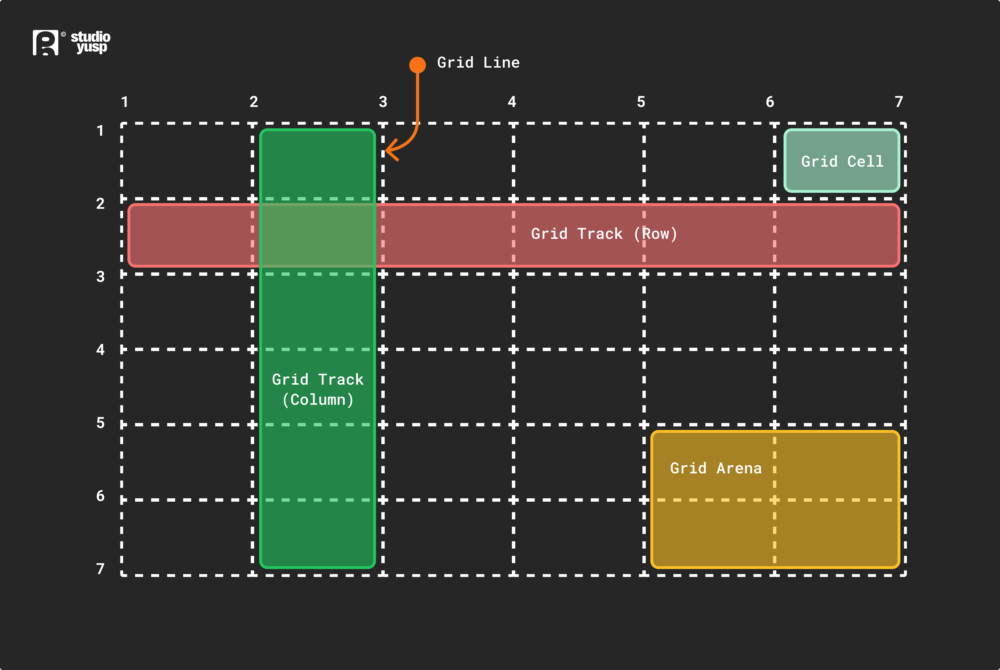
</p>

* **Grid item**: Đối tượng được chứa trong container lưới.
* **Grid line**: Đường lưới là đường thẳng đứng hoặc đường ngang tạo nên cấu trúc của lưới.
* **Grid cell**: Đơn vị nhỏ nhất trên lưới được gọi là ô lưới. Nó là khoảng trống giữa hai hàng và cột liền kề.
* **Rows**: Hàng lưới là đường ray ngang của lưới.
* **Columns**: Cột lưới là đường ray dọc của lưới.
* **Gutter**: Gutter là khoảng trống giữa các hàng và cột trong lưới.


**CSS Grid Properties:**

|Thuộc tính        |Mô tả                      |
|-----------------|----------------------------------|
|column-gap	      |Chỉ định khoảng cách giữa các cột|
|gap	            |Một thuộc tính viết tắt cho các thuộc tính row-gap và column-gap|
|grid	            |Một thuộc tính viết tắt cho các thuộc tính grid-template-rows, grid-template-columns, grid-template-areas, grid-auto-rows, grid-auto-columns và grid-auto-flow|
|grid-area	      |Hoặc chỉ định tên cho grid item, hoặc thuộc tính này là một thuộc tính viết tắt cho các thuộc tính grid-row-start, grid-column-start, grid-row-end và grid-column-end|
|grid-auto-columns|Chỉ định kích thước cột mặc định|
|grid-auto-flow	  |Chỉ định cách các item được tự động đặt vào trong lưới|
|grid-auto-rows	  |Chỉ định kích thước hàng mặc định|
|grid-column	    |Một thuộc tính viết tắt cho các thuộc tính grid-column-start và grid-column-end|
|grid-column-end	|Chỉ định nơi kết thúc grid item|
|grid-column-gap	|Chỉ định kích thước khoảng cách giữa các cột|
|grid-column-start|Chỉ định nơi bắt đầu grid item|
|grid-gap	        |Một thuộc tính viết tắt cho các thuộc tính grid-row-gap và grid-column-gap|
|grid-row	        |Một thuộc tính viết tắt cho các thuộc tính grid-row-start và grid-row-end|
|grid-row-end	    |Chỉ định nơi kết thúc grid item|
|grid-row-gap	    |Chỉ định kích thước khoảng cách giữa các hàng|
|grid-row-start	  |Chỉ định nơi bắt đầu grid item|
|grid-template	  |Một thuộc tính viết tắt cho các thuộc tính grid-template-rows, grid-template-columns và grid-areas|
|grid-template-areas|Chỉ định cách hiển thị các cột và hàng, bằng cách sử dụng các grid item có tên|
|grid-template-columns	|Chỉ định kích thước của các cột và số lượng cột trong bố cục lưới|
|grid-template-rows	    |Chỉ định kích thước của các hàng trong bố cục lưới|
|row-gap	         |Chỉ định khoảng cách giữa các hàng lưới|


**Example:**

```html
<!DOCTYPE html>
<html>
<head>
  <title>Grid Layout</title>
  <style>
    .item1 {
        grid-area: header;
    }

    .item2 {
        grid-area: menu;
    }

    .item3 {
        grid-area: main;
    }

    .item4 {
        grid-area: right;
    }

    .item5 {
        grid-area: footer;
    }

    .grid-container {
        display: grid;
        grid-template-areas:
            'header header header header header header'
            'menu main main main right right'
            'menu footer footer footer footer footer';
        grid-gap: 10px;
        background-color: rgba(155, 249, 249);
        padding: 10px;
    }

    .grid-container>div {
        background-color: rgba(0, 150, 149);
        text-align: center;
        padding: 20px 0;
        font-size: 30px;
    }
  </style>
  </head>
<body>
  <h1>Grid Layout</h1>
  <p>This grid layout contains six columns and three rows:</p>

  <div class="grid-container">
    <div class="item1">Header</div>
    <div class="item2">Menu</div>
    <div class="item3">main</div>
    <div class="item4">Right</div>
    <div class="item5">Footer</div>
  </div>
</body>
</html>
```


<div align="right">
    <b><a href="#">↥ back to top</a></b>
</div>

## Q. CSS flexbox là gì?

Mô-đun flexbox, giúp thiết kế cấu trúc bố cục linh hoạt đáp ứng dễ dàng hơn mà không cần sử dụng float hoặc positioning. Flexbox giúp việc căn chỉnh các mục theo chiều dọc và chiều ngang bằng cách sử dụng hàng và cột trở nên đơn giản. Các vật phẩm sẽ "flex" thành các kích cỡ khác nhau để lấp đầy khoảng trống.

Trước mô-đun Bố cục Flexbox, có bốn layout modes:

* **Block**, cho các phần trong một trang web
* **Inline**, cho văn bản
* **Table**, cho dữ liệu bảng hai chiều
* **Positioned**, cho vị trí rõ ràng của một phần tử

**Flex Container:**

Một vùng của tài liệu được trình bày bằng flexbox được gọi là **flex container**. Để tạo một vùng chứa linh hoạt, chúng ta đặt giá trị thuộc tính `display` của vùng chứa của vùng thành `flex` hoặc `inline-flex`. Ngay sau khi chúng tôi thực hiện việc này, các phần tử con trực tiếp của vùng chứa đó sẽ trở thành **flex items**.

**Thuật ngữ Flexbox:**

<p align="center">
  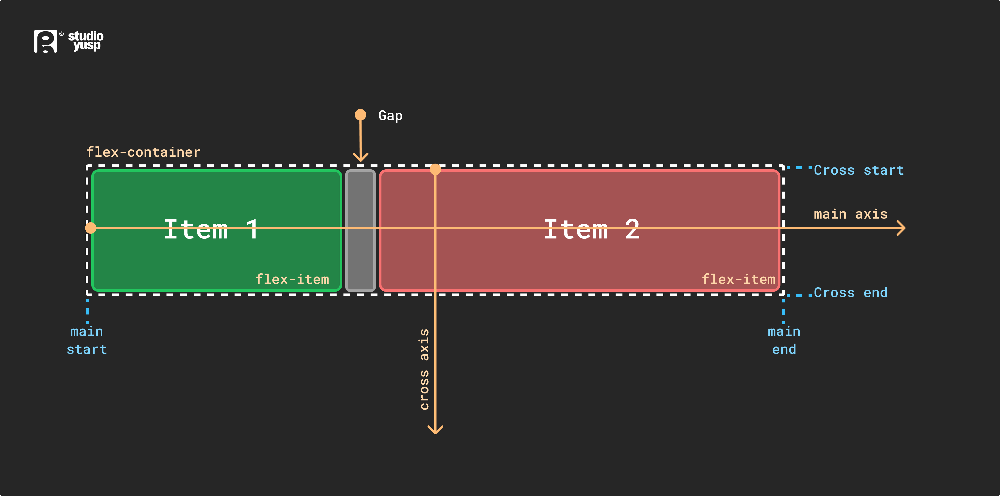
</p>

<div align="right">
    <b><a href="#">↥ back to top</a></b>
</div>

## Q. Tất cả các thuộc tính của flexbox?

**Thuộc tính CSS Flexbox Container:**

|Thuộc tính        |Giá trị|
|----------------|------------------|
|display:        |flexbox, inline-flex;|
|flex-direction: |row, row-reverse, column, column-reverse;|
|flex-wrap:      |nowrap, wrap, wrap-reverse;|
|flex-flow:      |`flex-direction`, `flex-wrap`|
|justify-content:|flex-start, flex-end, center, space-between, space-around;|
|align-items:    |flex-start, flex-end, center, baseline, stretch;|
|align-content:  |flex-start, flex-end, center, space-between, space-around, stretch;|

**Thuộc tính CSS Flexbox:**

|Thuộc tính        |Giá trị|
|----------------|------------------|
|order:          |`<integer>`;                        |
|flex-grow:      |`<number>`; /* default 0 */         |
|flex-shrink:    |`<number>`; /* default 1 */         |
|flex-basis:     |`<length>`, auto; /* default auto */|
|flex:           |none, [ <'flex-grow'> <'flex-shrink'>? || <'flex-basis'> ]|
|align-self:     |auto, flex-start, flex-end, center, baseline, stretch;|

**Example:**

```html
<!DOCTYPE html>
<html>
<head>
    <title>The flex-direction Property</title>
    <style>
        .flex-container {
            display: flex;
            flex-direction: column;
            background-color: DodgerBlue;
        }

        .flex-container>div {
            background-color: #f1f1f1;
            width: 100px;
            margin: 10px;
            text-align: center;
            line-height: 75px;
            font-size: 30px;
        }
    </style>
</head>
<body>
    <h1>The flex-direction Property</h1>
    <p>The "flex-direction: column;" stacks the flex items vertically (from top to bottom):</p>

    <div class="flex-container">
        <div>1</div>
        <div>2</div>
        <div>3</div>
    </div>
</body>
</html>
```


<div align="right">
    <b><a href="#">↥ back to top</a></b>
</div>

## Q. Khi nào nên sử dụng Grid và flexbox?

* CSS Grid Layout là một hệ thống **hai chiều**, nghĩa là nó có thể xử lý cả cột và hàng, không giống như flexbox phần lớn là hệ thống **một chiều** (trong một cột hoặc một hàng).
* Điểm khác biệt cốt lõi giữa CSS Grid và Flexbox là — cách tiếp cận của CSS Grid là **bố cục trước** trong khi cách tiếp cận của Flexbox là **nội dung trước tiên**. Nếu bạn nhận thức rõ về nội dung của mình trước khi tạo bố cục, thì hãy mù quáng chọn Flexbox và nếu không, hãy chọn CSS Grid.
* Bố cục Flexbox phù hợp nhất với các thành phần của ứng dụng (vì hầu hết chúng về cơ bản là tuyến tính) và các bố cục **quy mô nhỏ**, trong khi bố cục Lưới dành cho các bố cục **quy mô lớn hơn** tuyến tính trong thiết kế của họ.
* Nếu bạn chỉ cần xác định bố cục dưới dạng hàng hoặc cột thì có thể bạn cần flexbox. Nếu bạn muốn xác định lưới và điều chỉnh nội dung vào đó theo hai chiều - bạn cần có Grid.

<p align="center">
  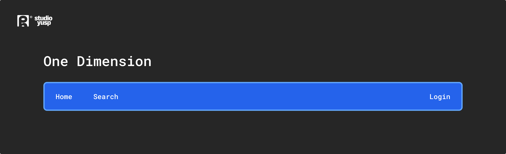
  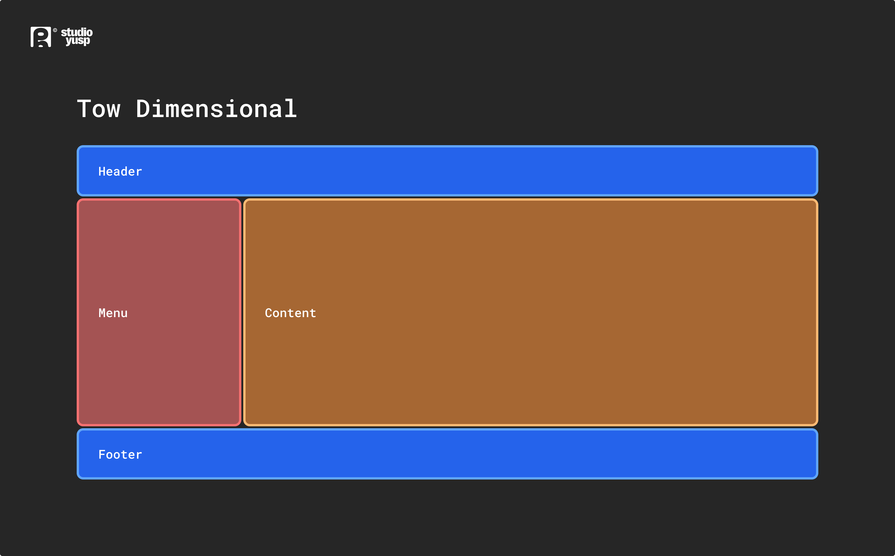
</p>

**Example:**

```html
<!DOCTYPE html>
<html>
  <head>
    <title>Grid vs Flexbox Layout</title>
  </head>
  <style>
    /* Grid layout */
    .row {
        display: grid;
        grid-template-columns: auto auto auto;
        background-color: #2196f3;
        padding: 5px;
    }

    .col-item {
        background-color: rgba(255, 255, 255, 0.8);
        border: 1px solid rgba(0, 0, 0, 0.8);
        padding: 10px;
        font-size: 30px;
        text-align: center;
    }

    /* Flexbox layout */
    .wrapper {
        border: 2px solid #f76707;
        border-radius: 5px;
        background-color: #fff4e6;
    }

    .wrapper > div {
        border: 2px solid #ffa94d;
        border-radius: 5px;
        background-color: #ffd8a8;
        padding: 1em;
        color: #d9480f;
    }

    .wrapper {
        display: flex;
        width: 500px;
        flex-wrap: wrap;
    }

    .wrapper > div {
        flex: 1 1 150px;
    }
  </style>
  <body>
    <p><h1>Grid Layout Example<hr/></h1></p>
    <div class="row">
        <div class="col-item">Column - 1</div>
        <div class="col-item">Column - 2</div>
        <div class="col-item">Column - 3</div>
        <div class="col-item">Column - 1</div>
        <div class="col-item">Column - 2</div>
        <div class="col-item">Column - 3</div>
        <div class="col-item">Column - 1</div>
        <div class="col-item">Column - 2</div>
        <div class="col-item">Column - 3</div>
    </div>

    <p><h1><br/>Flexbox Layout Example<hr/></h1></p>
    <div class="wrapper">
        <div>One</div>
        <div>Two</div>
        <div>Three</div>
        <div>Four</div>
        <div>Five</div>
    </div>
  </body>
</html>
```


<div align="right">
    <b><a href="#">↥ back to top</a></b>
</div>

## Q. CSS BEM là gì?

Phương pháp BEM (**Block Element Modifier**) là quy ước đặt tên cho các lớp CSS nhằm giúp CSS dễ bảo trì hơn bằng cách xác định các không gian tên để giải quyết các vấn đề về phạm vi. Khối là một thành phần độc lập có thể tái sử dụng trong các dự án và hoạt động như một "không gian tên" cho các thành phần phụ (Thành phần). Công cụ sửa đổi được sử dụng làm cờ khi Khối hoặc Phần tử ở trạng thái nhất định hoặc có cấu trúc hoặc kiểu dáng khác nhau.

```css
/* block component */
.block {
}

/* element */
.block__element {
}

/* modifier */
.block__element--modifier {
}
```

**Example:**

```css
.button {
	display: inline-block;
	border-radius: 3px;
	padding: 7px 12px;
	border: 1px solid #D5D5D5;
	background-image: linear-gradient(#EEE, #DDD);
	font: 700 13px/18px Helvetica, arial;
}
.button--success {
	color: #FFF;
	background: #569E3D linear-gradient(#79D858, #569E3D) repeat-x;
	border-color: #4A993E;
}
.button--danger {
	color: #900;
}
```

```html
<button class="button">
	Normal button
</button>
<button class="button button--success">
	Success button
</button>
<button class="button button--danger">
	Danger button
</button>
```

**Lợi ích:**

* **Tính mô-đun**: Kiểu Block không bao giờ phụ thuộc vào các thành phần khác trên một trang, do đó bạn sẽ không bao giờ gặp phải sự cố khi xếp tầng.
* **Khả năng sử dụng lại**: Soạn các Block độc lập theo nhiều cách khác nhau và tái sử dụng chúng một cách thông minh, giúp giảm số lượng mã CSS mà bạn sẽ phải duy trì.
* **Cấu trúc**: Phương pháp BEM cung cấp cho mã CSS của bạn một cấu trúc vững chắc nhưng vẫn đơn giản và dễ hiểu.

<div align="right">
    <b><a href="#">↥ back to top</a></b>
</div>

## Q. Lợi ích của việc sử dụng CSS sprites là gì?

CSS sprite kết hợp nhiều hình ảnh thành một hình ảnh lớn hơn. Đây là một kỹ thuật thường được sử dụng cho các biểu tượng. 

**Thuận lợi:**

* Giảm số lượng yêu cầu ```HTTP``` cho nhiều hình ảnh (chỉ cần một yêu cầu duy nhất cho mỗi spritesheet). Nhưng với ```HTTP2```, việc tải nhiều hình ảnh không còn là vấn đề nữa.
* Tải xuống trước các nội dung sẽ không được tải xuống cho đến khi cần, chẳng hạn như hình ảnh chỉ xuất hiện ở trạng thái giả `:hover`. Nhấp nháy sẽ không được nhìn thấy.


* Khi bạn có nhiều hình ảnh/biểu tượng, trình duyệt sẽ thực hiện lệnh gọi riêng tới máy chủ cho từng hình ảnh/biểu tượng đó. sprite là một kỹ thuật kết hợp tất cả/một số trong số chúng (thường giống nhau về loại hình ảnh. Ví dụ: bạn sẽ đặt jpg vào một sprite) trong một hình ảnh. Để hiển thị biểu tượng bạn đặt chiều cao, chiều rộng và vị trí nền.

**Các lựa chọn thay thế:**

* URI dữ liệu - cho phép bạn nhúng dữ liệu hình ảnh trực tiếp vào biểu định kiểu. Điều này tránh các yêu cầu HTTP bổ sung cho hình ảnh, khiến nó về cơ bản giống như một sprite mà không có vị trí ưa thích.
* Icon Fonts
* SVG

<div align="right">
    <b><a href="#">↥ back to top</a></b>
</div>

## Q. Tweening trong css là gì?

Tùy chọn **pose-to-pose** là tạo một vài khung hình chính trong suốt chuỗi, sau đó điền vào các khoảng trống sau đó. Việc lấp đầy những khoảng trống này được gọi là tweening. Đó là quá trình tạo khung trung gian giữa hai hình ảnh. Nó mang lại ấn tượng rằng hình ảnh đầu tiên đã phát triển suôn sẻ thành hình ảnh thứ hai. Trong CSS3, mô-đun Transforms (matrix, translate, rotate, scale, v.v.) có thể được sử dụng để đạt được hiệu ứng tweening.

**Example:**

```css
p {
  animation-duration: 3s;
  animation-name: slidein;
}

@keyframes slidein {
  from {
    margin-left: 100%;
    width: 300%; 
  }

  to {
    margin-left: 0%;
    width: 100%;
  }
}
```

<div align="right">
    <b><a href="#">↥ back to top</a></b>
</div>

## Q. Giải thích sự khác biệt giữa `visibility:hidden;` và `display: none;`? Những ưu và nhược điểm của việc sử dụng `display:none` là gì?

* **visibility: hidden** chỉ ẩn phần tử nhưng nó sẽ chiếm không gian và ảnh hưởng đến bố cục của tài liệu.
* **display: none** xóa phần tử khỏi luồng bố cục thông thường (gây ra hiện tượng chỉnh lại dòng DOM). Nó sẽ không ảnh hưởng đến bố cục của tài liệu cũng như không chiếm dung lượng.

<div align="right">
    <b><a href="#">↥ back to top</a></b>
</div>

## Q. Mục đích của `z-index` là gì và bối cảnh xếp chồng được hình thành như thế nào?

`z-index` giúp chỉ định thứ tự ngăn xếp của các phần tử được định vị có thể chồng lên nhau. Giá trị mặc định `z-index` bằng 0 và có thể nhận số dương hoặc số âm. Phần tử có `z-index` cao hơn luôn được xếp chồng lên trên chỉ mục thấp hơn.

`z-index` có thể nhận các giá trị sau:

  * **Auto**: Đặt thứ tự ngăn xếp bằng với cha mẹ của nó.
  * **Number**: Sắp xếp thứ tự ngăn xếp.
  * **Initial**: Đặt thuộc tính này về giá trị mặc định (0).
  * **Inherit**: Kế thừa thuộc tính này từ phần tử cha của nó.

**Example:**

```html
<!DOCTYPE html>
<html>
  <head>
    <title>CSS z-index Property</title>
    <style>
      img {
        position: absolute;
        left: 0px;
        top: 0px;
        padding: 5px 2px;
        margin: 5px 1px 2px;
        z-index: -1;
      }

      p {
        color: red;
        font-size: 20px;
        font-family: 'Segoe UI', Tahoma, Geneva, Verdana, sans-serif;
      }
    </style>
  </head>
  <body>
    <h1>The z-index Property</h1>
    
    <p>Because the image has a z-index of -1, it will be placed behind the heading.</p>
  </body>
</html>
```


<div align="right">
    <b><a href="#">↥ back to top</a></b>
</div>

## Q. Giải thích thuộc tính Position CSS?

<p align="center">
  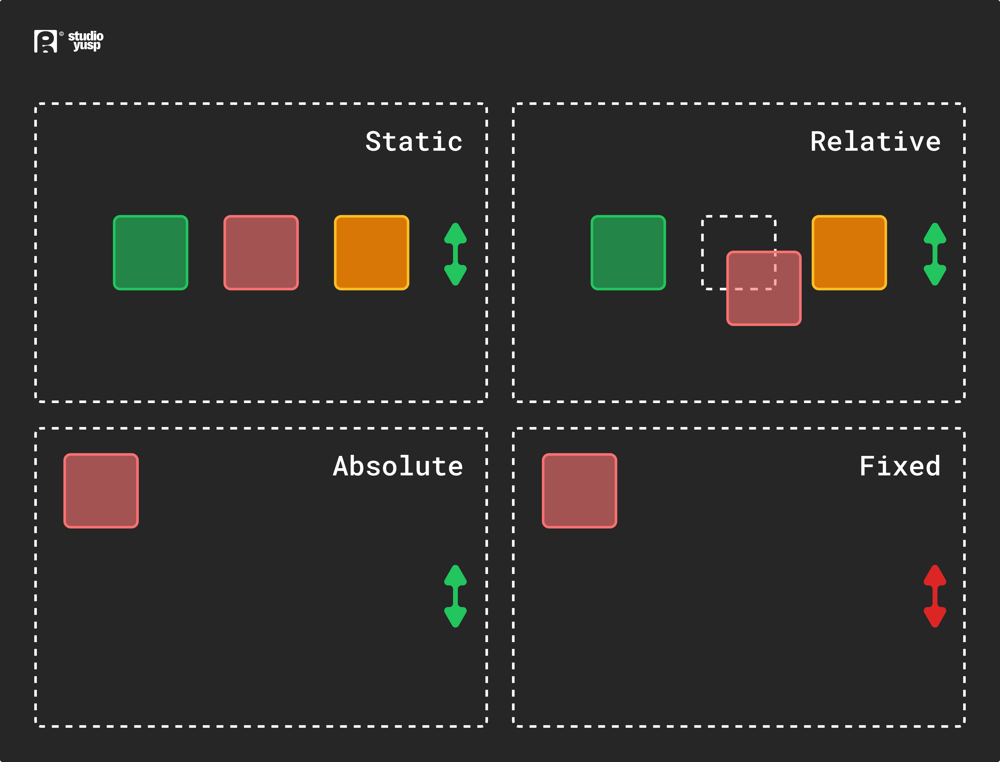
</p>

* **absolute**, Định vị tuyệt đối đặt một phần tử chính xác vị trí bạn muốn đặt nó. Vị trí tuyệt đối thực sự được đặt tương đối so với thẻ cha của phần tử. Nếu không có thẻ cha nào có sẵn, thì nó sẽ được đặt tương đối so với chính trang (nó sẽ mặc định quay trở lại thẻ <html>).

* **relative**, Định vị tương đối có nghĩa là "tương đối so với chính nó". Thiết lập position: relative; trên một phần tử và không có thuộc tính định vị nào khác, nó sẽ không ảnh hưởng đến vị trí của phần tử đó. Nó cho phép sử dụng z-index trên phần tử và nó giới hạn phạm vi của các phần tử con được định vị tuyệt đối. Bất kỳ phần tử con nào sẽ được định vị tuyệt đối trong khối đó.

* **fixed**, Phần tử được định vị tương đối so với vùng nhìn hoặc chính cửa sổ trình duyệt. Vùng nhìn không thay đổi nếu bạn cuộn và do đó phần tử được cố định sẽ luôn ở đúng vị trí đó.

* **static**, Định vị mặc định cho mọi phần tử trang. Lý do duy nhất bạn có thể đặt phần tử thành position: static là để loại bỏ một cách cưỡng bức một số định vị được áp dụng cho phần tử nằm ngoài tầm kiểm soát của bạn.

* **sticky**, Định vị cố định là sự kết hợp của định vị tương đối và định vị cố định. Phần tử được coi là được định vị tương đối cho đến khi vượt qua ngưỡng đã xác định, tại thời điểm đó nó được coi là được định vị cố định.

<div align="right">
    <b><a href="#">↥ back to top</a></b>
</div>

## Q. Sự khác biệt giữa relative và absolute trong CSS là gì?

**Relative Position**

Một phần tử có `position: relative;` được định vị so với vị trí bình thường của nó.

Việc đặt các thuộc tính trên, phải, dưới và trái của một phần tử có vị trí tương đối sẽ khiến phần tử đó bị điều chỉnh khỏi vị trí bình thường. Nội dung khác sẽ không được điều chỉnh để phù hợp với bất kỳ khoảng trống nào mà phần tử để lại.

<p align="center">
  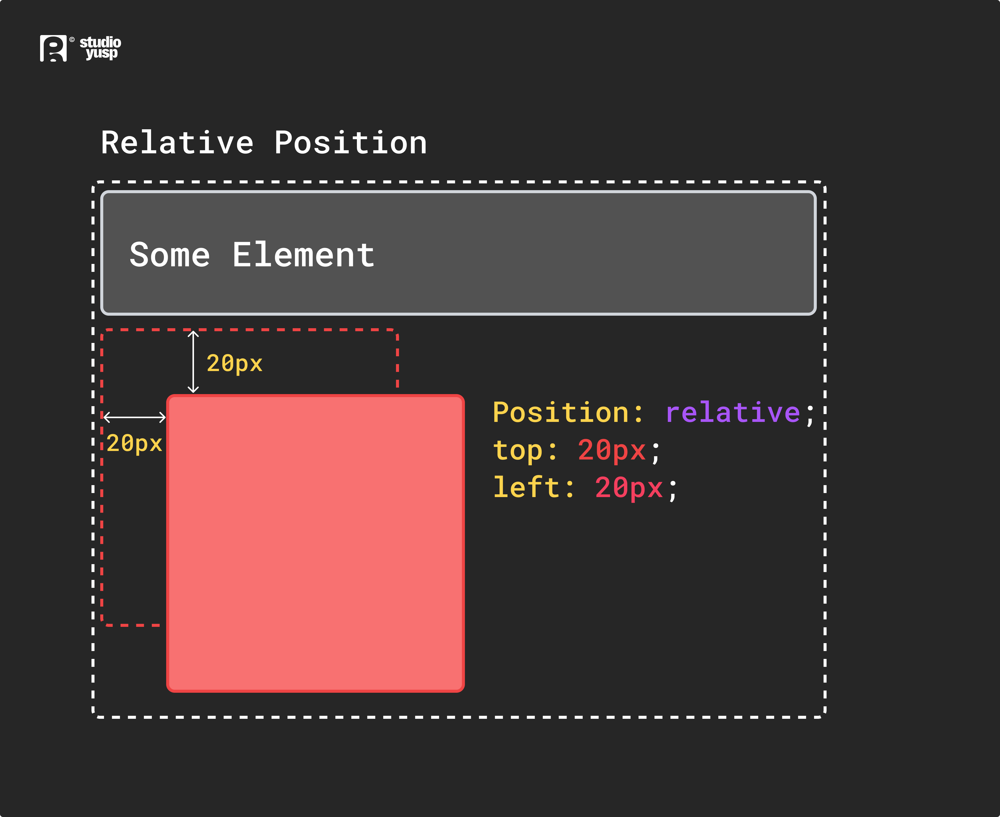
</p>

**Example:**

```html
<!DOCTYPE html>
<html>
<head>
  <title>Relative Position</title>
  <style>
    div.relative {
      position: relative;
      top: 20px;
      left: 20px;
      border: 3px solid #2321ad;
    }
  </style>
</head>
<body>
    <h2>position: relative;</h2>
    <p>An element with position: relative; is positioned relative to its normal position:</p>

    <div class="relative">
        This div element has position: relative;
    </div>
</body>
</html>
```

**Absolute Position:**

Một phần tử có `position: absolute;` sẽ khiến nó điều chỉnh vị trí của nó so với phần tử mẹ của nó. Nếu không có cha mẹ thì nó sẽ sử dụng nội dung tài liệu làm cha mẹ.

<p align="center">
  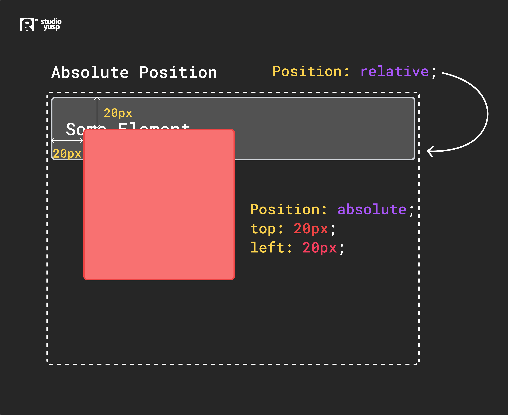
</p>

**Example:**

```html
<!DOCTYPE html>
<html>
<head>
  <title>Absolute Position</title>
  <style>
    div.relative {
      position: relative;
      width: 400px;
      height: 200px;
      border: 3px solid #2321ad;
    }  

    div.absolute {
      position: absolute;
      top: 80px;
      right: 0;
      width: 200px;
      height: 100px;
      border: 3px solid #ee0b0b;
    }
  </style>
</head>
<body>
    <h2>position: absolute;</h2>

    <p>An element with position: absolute; is positioned relative to the nearest positioned ancestor 
      (instead of positioned relative to the viewport, like fixed):</p>

    <div class="relative">This div element has position: relative;
        <div class="absolute">This div element has position: absolute;</div>
    </div>
</body>
</html>
```

<div align="right">
    <b><a href="#">↥ back to top</a></b>
</div>

## Q. Sự khác biệt giữa phần tử block, inline and inline-block?

**a) Block Elements**  
Các Block Elements luôn bắt đầu trên một dòng mới. Chúng cũng sẽ chiếm không gian của toàn bộ hàng hoặc chiều rộng. Danh sách các phần tử khối là `<p>`, `<h1>`, `<div>`, `<header>`.

**Example:**

```html
<p>
  Lorem ipsum dolor sit amet consectetur adipisicing elit. Unde autem,
  consequatur deleniti nobis beatae quo dolore nemo corporis. Ad delectus
  dignissimos pariatur illum eveniet dolor rem eius laborum sed iure!
</p>

<p>
  Lorem ipsum dolor sit amet consectetur adipisicing elit. Unde autem,
  consequatur deleniti nobis beatae quo dolore nemo corporis. Ad delectus
  dignissimos pariatur illum eveniet dolor rem eius laborum sed iure!
</p>
```

**b) Inline Elements**  
Inline Elements không bắt đầu trên một dòng mới, chúng xuất hiện trên cùng một dòng với nội dung và các thẻ bên cạnh chúng. Một số ví dụ về phần tử nội tuyến là các thẻ `<a>`, `<span>` , `<strong>` và ``.

Khi nói đến margins và padding, trình duyệt xử lý các inline elements một cách khác nhau. Bạn có thể thêm khoảng trắng ở bên trái và bên phải trên một inline elements, nhưng bạn không thể thêm chiều cao cho padding trên cùng hoặc dưới cùng hoặc margin của inline element.

**Example:**

```html
<a href="#">Link</a>

<span>Span</span>
<strong>Strong Player</strong>
```

**c) Inline-Block Elements**  

Inline-block elements tương tự như các Inline Elements, ngoại trừ chúng có thể có padding và margins được thêm vào cả bốn phía.
Một cách sử dụng phổ biến để sử dụng Inline-Block là tạo liên kết điều hướng theo chiều ngang. Một số ví dụ về phần tử khối nội tuyến là `<input>`, `<button>`, `<select>`, `<textarea>`, v.v.

```css
input {
  width: 300px;
  height: 50px;
}

button {
  width: 100px;
  height: 50px;
  margin-top: 20px;
}
```

```html
<input type="text" /> <button>Submit</button>
```

<div align="right">
    <b><a href="#">↥ back to top</a></b>
</div>

## Q. Bộ đếm trong CSS3 là gì?

Bộ đếm CSS cho phép bạn điều chỉnh giao diện của nội dung dựa trên vị trí của nó trong tài liệu. Để sử dụng bộ đếm CSS, trước tiên nó phải được khởi tạo thành một giá trị có thuộc tính `counter-reset` (0 theo mặc định). Thuộc tính tương tự cũng có thể được sử dụng để thay đổi giá trị của nó thành bất kỳ số cụ thể nào. Sau khi được khởi tạo, giá trị của bộ đếm có thể tăng hoặc giảm theo mức tăng của bộ đếm. Tên của bộ đếm không được là "none", "inherit" hoặc "initial"; nếu không thì dòng code sẽ bị bỏ qua.

```css
body {
  counter-reset: section;   /* Đặt bộ đếm có tên là 'section' và initial value là 0*/
}

h3::before {
  counter-increment: section;   /* Tăng giá trị của bộ đếm phần lên 1*/
  content: "Section " counter(section) ": ";  /* Hiển thị từ “Section”, 
                                              giá trị của bộ đếm phần và
                                              dấu hai chấm trước nội dung của mỗi h3 */
}
```

```html
<h3>Introduction</h3>
<h3>Body</h3>
<h3>Conclusion</h3>
```

**CSS Counter Properties:**

|Thuộc tính	        |Mô tả  |	
|-----------------|-------------------------------------------------------------------------------|
|content	        |Được sử dụng với các pseudo-elements ::before và ::after, để chèn nội dung được tạo|
|counter-increment|Tăng giá trị của một hoặc nhiều bộ đếm|
|counter-reset	  |Tạo hoặc đặt lại một hoặc nhiều bộ đếm|

**Example:**

```html
<!DOCTYPE html>
<html>
<head>
  <style>
    body {
      counter-reset: section;   /* Set a counter named 'section', and its initial value is 0. */
    }

    h3::before {
      counter-increment: section;   /* Increment the value of section counter by 1 */
      content: "Section " counter(section) ": ";  /* Display the word 'Section ', the value of 
                                                 section counter, and a colon before the content
                                                 of each h3 */
    }   
  </style>
</head>
<body>
  <h3>Introduction</h3>
  <h3>Body</h3>
  <h3>Conclusion</h3>
</body>
</html>
```


<div align="right">
    <b><a href="#">↥ back to top</a></b>
</div>

## Q. Chỉ định đơn vị trong CSS như thế nào?

Có nhiều đơn vị khác nhau trong CSS để thể hiện số đo và độ dài. Đơn vị CSS được sử dụng để xác định kích thước thuộc tính mà chúng tôi đặt cho một phần tử hoặc nội dung của nó. Các đơn vị trong CSS bắt buộc phải xác định được số đo như: lề: 20px; trong đó px (hoặc pixel) là đơn vị CSS. Chúng được sử dụng để đặt lề, phần đệm, độ dài, v.v.

Đơn vị độ dài trong CSS có hai loại:

* Đơn vị độ dài tuyệt đối.
* Đơn vị độ dài tương đối.

**Đơn vị độ dài tuyệt đối:**

Sau đây là tất cả các đơn vị độ dài tuyệt đối - chúng không liên quan đến bất kỳ thứ gì khác và thường được coi là luôn có cùng kích thước.

|Đơn vị	        |Tên	                |Tương đương với       |
|-------------|---------------------|---------------------|
|cm	          |Centimeters	        |1cm = 38px = 25/64in|
|mm	          |Millimeters	        |1mm = 1/10 của 1cm|
|Q	          |Quarter-millimeters	|1Q = 1/40 của 1cm|
|in	          |Inches	              |1in = 2.54cm = 96px|
|pc	          |Picas	              |1pc = 1/6 của 1in|
|pt	          |Points	              |1pt = 1/72 của 1in|
|px	          |Pixels	              |1px = 1/96 của 1in|

**Đơn vị độ dài tương đối:**

Đơn vị độ dài tương đối chỉ định độ dài tương ứng với thuộc tính độ dài khác. Đơn vị độ dài tương đối có tỷ lệ tốt hơn giữa các phương tiện hiển thị khác nhau.

|Unit	           |Relative to                                   |
|----------------|----------------------------------------------|
|em	             |Kích thước phông chữ của phần tử cha, trong trường hợp của các thuộc tính kiểu chữ như font-size, và kích thước phông chữ của chính phần tử, trong trường hợp của các thuộc tính khác như width.|
|ex	             |X-height của phông chữ của phần tử.|
|ch	             |Vết đo lường trước (chiều rộng) của ký tự "0" của phông chữ của phần tử.|
|rem	           |Kích thước phông chữ của phần tử gốc.|
|lh	             |Chiều cao dòng của phần tử.|
|vw	             |1% chiều rộng của vùng nhìn.|
|vh	             |1% chiều cao của vùng nhìn.|
|vmin	           |1% kích thước nhỏ hơn của vùng nhìn.|
|vmax	           |1% kích thước lớn hơn của vùng nhìn.|

**Example:**

```html
<!DOCTYPE html>
<html>
  <head>
      <title>CSS Units</title>
    <style>
      .wrapper {
        font-size: 1em;
      }
      
      .px {
        width: 200px;
      }
      
      .vw {
        width: 10vw;
      }
      
      .em {
        width: 10em;
      }
    </style>
  </head>
<body>
  <div class="wrapper">
    <div class="box px">I am 200px wide</div>
    <div class="box vw">I am 10vw wide</div>
    <div class="box em">I am 10em wide</div>
  </div>
</body>
</html>
```


<div align="right">
    <b><a href="#">↥ back to top</a></b>
</div>

## Q. Cái nào được sử dụng nhiều hơn trong số px, em % hoặc pt và tại sao?

* `px` cung cấp khả năng kiểm soát chi tiết và duy trì căn chỉnh vì 1 px hoặc bội số của 1 px được đảm bảo trông sắc nét. px không phải là cascade, điều này có nghĩa là nếu font-size của phần tử cha là 20px và phần tử con là 16px. phần tử con sẽ là 16px.

* `em` duy trì kích thước tương đối. bạn có thể có phông chữ đáp ứng. em là chiều rộng của chữ cái 'm' trong kiểu chữ đã chọn. Tuy nhiên, khái niệm này khá phức tạp. 1em bằng với kích thước phông chữ hiện tại của phần tử hoặc mặc định của trình duyệt. nếu bạn đặt font-size thành 16px thì 1em = 16px. Thực tiễn phổ biến là đặt font-size mặc định của phần tử body thành 62.5% (tương đương với 10px). em là cascade

* `%` đặt font-size tương đối so với font-size của body. Do đó, bạn phải đặt font-size của body ở một kích thước hợp lý. điều này rất dễ sử dụng và không cascade. ví dụ: nếu font-size của phần tử cha là 20px và font-size của phần tử con là 50%. phần tử con sẽ là 10px.

* `pt` (điểm) thường được sử dụng trong in ấn. 1pt = 1/72 inch và nó là đơn vị kích thước cố định.


<div align="right">
    <b><a href="#">↥ back to top</a></b>
</div>

## Q. Pseudo element và Pseudo class là gì?

**1. Pseudo Element**: Phần tử giả CSS được sử dụng để tạo kiểu cho các phần được chỉ định của phần tử.

Ví dụ: nó có thể được sử dụng để:

* Tạo kiểu cho chữ cái hoặc dòng đầu tiên của một phần tử
* Chèn nội dung vào trước hoặc sau nội dung của một phần tử

**CSS Pseudo Elements:**  

|STT|Selector	      |Ví dụ	        |Mô tả|
|-----|---------------|-----------------|-------------|
| 01. |::after	      |p::after	        |Chèn một cái gì đó sau nội dung của mỗi phần tử <p>|
| 02. |::before	      |p::before	      |Chèn một cái gì đó trước nội dung của mỗi phần tử <p>|
| 03. |::first-letter	|p::first-letter	|Chọn chữ cái đầu tiên của mỗi phần tử <p>|
| 04. |::first-line	  |p::first-line	  |Chọn dòng đầu tiên của mỗi phần tử <p>|
| 05. |::selection	  |p::selection	    |Chọn phần của một phần tử được người dùng chọn|


**2. Pseudo-classes**: Một lớp giả được sử dụng để xác định trạng thái đặc biệt của một phần tử.

Ví dụ: nó có thể được sử dụng để:

* Tạo kiểu cho một phần tử khi người dùng di chuột qua nó
* Tạo kiểu khác nhau cho các liên kết đã truy cập và chưa truy cập
* Tạo kiểu cho một phần tử khi nó được lấy nét

**CSS Pseudo Classes:**  

| STT |Selector	         | Ví dụ	              |Mô tả|
|-------|------------------|------------------------|-----------|
| 01.  |:active	           |a:active	              |Chọn liên kết đang hoạt động|
| 02.  |:checked	         |input:checked	          |Chọn tất cả các phần tử <input> được chọn|
| 03.  |:disabled	         |input:disabled	        |Chọn tất cả các phần tử <input> bị vô hiệu hóa|
| 04.  |:empty	           |p:empty	                |Chọn tất cả các phần tử <p> không có con|
| 05.  |:enabled	         |input:enabled	          |Chọn tất cả các phần tử <input> được bật|
| 06.  |:first-child	     |p:first-child	          |Chọn tất cả các phần tử <p> là con đầu tiên của cha mẹ của nó|
| 07.  |:first-of-type	   |p:first-of-type	        |Chọn tất cả các phần tử <p> là phần tử <p> đầu tiên của cha mẹ của nó|
| 08.  |:focus	           |input:focus	            |Chọn phần tử <input> có focus|
| 09.  |:hover	           |a:hover	                |Chọn các liên kết khi di chuột qua|
| 10.  |:in-range	         |input:in-range	        |Chọn các phần tử <input> có giá trị nằm trong một phạm vi được chỉ định|
| 11.  |:invalid	         |input:invalid	          |Chọn tất cả các phần tử <input> có giá trị không hợp lệ|
| 12.  |:lang(language)	   |p:lang(it)	            |Chọn tất cả các phần tử <p> có giá trị thuộc tính lang bắt đầu bằng "it"|
| 13.  |:last-child	       |p:last-child	          |Chọn tất cả các phần tử <p> là con cuối cùng của cha mẹ của nó|
| 14.  |:last-of-type	     |p:last-of-type	        |Chọn tất cả các phần tử <p> là phần tử <p> cuối cùng của cha mẹ của nó|
| 15.  |:link	             |a:link	                |Chọn tất cả các liên kết chưa được truy cập|
| 16.  |:not(selector)	   |:not(p)	                |Chọn tất cả các phần tử không phải là phần tử <p>|
| 17.  |:nth-child(n)	     |p:nth-child(2)	        |Chọn tất cả các phần tử <p> là con thứ hai của cha mẹ của nó|
| 18.  |:nth-last-child(n) |p:nth-last-child(2)	    |Chọn tất cả các phần tử <p> là con thứ hai của cha mẹ của nó, đếm từ con cuối cùng|
| 19.  |:nth-last-of-type(n) |p:nth-last-of-type(2)	|Chọn tất cả các phần tử <p> là phần tử <p> thứ hai của cha mẹ của nó, đếm từ con cuối cùng|
| 20.  |:nth-of-type(n)	    |p:nth-of-type(2)	      |Chọn tất cả các phần tử <p> là phần tử <p> thứ hai của cha mẹ của nó|
| 21.  |:only-of-type	      |p:only-of-type	        |Chọn tất cả các phần tử <p> là phần tử <p> duy nhất của cha mẹ của nó|
| 22.  |:only-child	        |p:only-child	          |Chọn tất cả các phần tử <p> là con duy nhất của cha mẹ của nó|
| 23.  |:optional	          |input:optional	        |Chọn các phần tử <input> không có thuộc tính "required"|
| 24.  |:out-of-range	      |input:out-of-range	    |Chọn các phần tử <input> có giá trị nằm ngoài phạm vi được chỉ định|
| 25.  |:read-only	        |input:read-only	      |Chọn các phần tử <input> có thuộc tính "readonly" được chỉ định|
| 26.  |:read-write	        |input:read-write	      |Chọn các phần tử <input> không có thuộc tính "readonly"|
| 27.  |:required	          |input:required	        |Chọn các phần tử <input> có thuộc tính "required" được chỉ định|
| 28.  |:root               |:root                  |Chọn phần tử gốc của tài liệu|
| 29.  |:target	            |#news:target	          |Chọn phần tử #news hoạt động hiện tại (đã nhấp vào URL có chứa tên neo đó)|
| 30.  |:valid	            |input:valid	          |Chọn tất cả các phần tử <input> có giá trị hợp lệ|
| 31.  |:visited	          |a:visited	            |Chọn tất cả các liên kết đã truy cập|

<div align="right">
    <b><a href="#">↥ back to top</a></b>
</div>

## Q. Giải thích “Box Model” CSS và các thành phần bố cục mà nó bao gồm?

Mô hình hộp CSS là mô hình bố cục hình chữ nhật cho các phần tử HTML bao gồm:

* **Content**: Nội dung của hộp, nơi xuất hiện văn bản và hình ảnh
* **Padding**: Vùng trong suốt bao quanh nội dung (tức là khoảng cách giữa đường viền và nội dung)
* **Border**: Đường viền bao quanh phần đệm (nếu có) và nội dung
* **Margin**: Vùng trong suốt xung quanh đường viền (tức là khoảng cách giữa đường viền và bất kỳ phần tử lân cận nào)

<p align="center">
  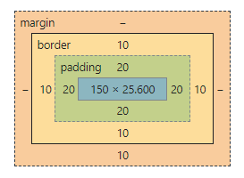
</p>

Kích thước của hộp được tính như sau:

|Thuộc tính |Tổng                                                             |
|---------|------------------------------------------------------------------|
|Width    |width + padding-left + padding-right + border-left + border-right |
|Height   |height + padding-top + padding-bottom + border-top + border-bottom|

**Example:**

```html
<!DOCTYPE html>
<html>
<head>
  <title>CSS Box Model</title>
  <style>
    div {
      background-color: lightgrey;
      width: 300px;
      border: 10px solid rgb(3, 141, 233);
      padding: 50px;
      margin: 20px;
    }
  </style>
</head>
<body>
  <h2>CSS Box Model</h2>

  <p>The CSS box model is essentially a box that wraps around every HTML element. 
    It consists of: borders, padding, margins, and the actual content.</p>

  <div>This text is the content of the box. We have added a 50px padding, 20px margin and a 10px blue 
    border.</div>
</body>
</html>
```

<div align="right">
    <b><a href="#">↥ back to top</a></b>
</div>

## Q. Bạn làm cách nào để yêu cầu trình duyệt trong CSS hiển thị bố cục của bạn trong các box models khác nhau?

Thuộc tính **box-sizing** cho phép chúng ta bao gồm phần đệm và đường viền trong tổng chiều rộng và chiều cao của phần tử. Nếu bạn đặt `box-sizing: border-box;` trên một phần tử, phần đệm và đường viền sẽ được bao gồm trong chiều rộng và chiều cao

**Syntax:**

```css
box-sizing: content-box|border-box|initial|inherit;
```

**Property Values:**

|Giá trị       |Mô tả                              |
|------------|-----------------------------------------|
|content-box |Mặc định. Các thuộc tính width và height (và các thuộc tính min/max) chỉ bao gồm content. Không bao gồm border và padding|
|border-box	 |Các thuộc tính width và height (và các thuộc tính min/max) bao gồm content, padding and border|
|initial	   |Đặt thuộc tính này về giá trị mặc định của nó. (hãy kham thảo về initial)|
|inherit	   |Kế thừa thuộc tính này từ phần tử cha của nó. (hãy kham thảo về inherit)|

**Example:**

```html
<!DOCTYPE html>
<html>
<head>
  <title>The box-sizing Property</title>
  <style>
    .content-box {
        box-sizing: content-box;
        width: 300px;
        height: 100px;
        padding: 30px;
        border: 10px solid rgb(0, 89, 255);
    }

    .border-box {
        box-sizing: border-box;
        width: 300px;
        height: 100px;
        padding: 30px;
        border: 10px solid rgb(255, 102, 0);
    }
  </style>
</head>
<body>
    <h2>The box-sizing Property</h2>
    <p>Defines how the width and height of an element are calculated: should they include padding 
      and borders, or not.</p>

    <h3>1. box-sizing: content-box (default):</h3>
    <p>Width and height only apply to the content of the element:</p>
    <div class="content-box">This div has a width of 300px. But the full width is 300px + 20px 
      (left and right border) + 60px (left and right padding) = 380px!</div>

    <h3>2. box-sizing: border-box:</h3>
    <p>Width and height apply to all parts of the element: content, padding and borders:</p>
    <div class="border-box">Here, the full width is 300px</div>
</body>
</html>
```

<div align="right">
    <b><a href="#">↥ back to top</a></b>
</div>

## Q. Sự khác biệt giữa border-box và content-box?

**1. content-box:**

Thuộc tính box-sizing mặc định. Thuộc tính width và height (và thuộc tính min/max) chỉ bao gồm content. Không bao gồm đường Border và padding

**2. border-box:**

Thuộc tính width và height (và thuộc tính min/max) bao gồm content, padding và border.

<p align="center">
  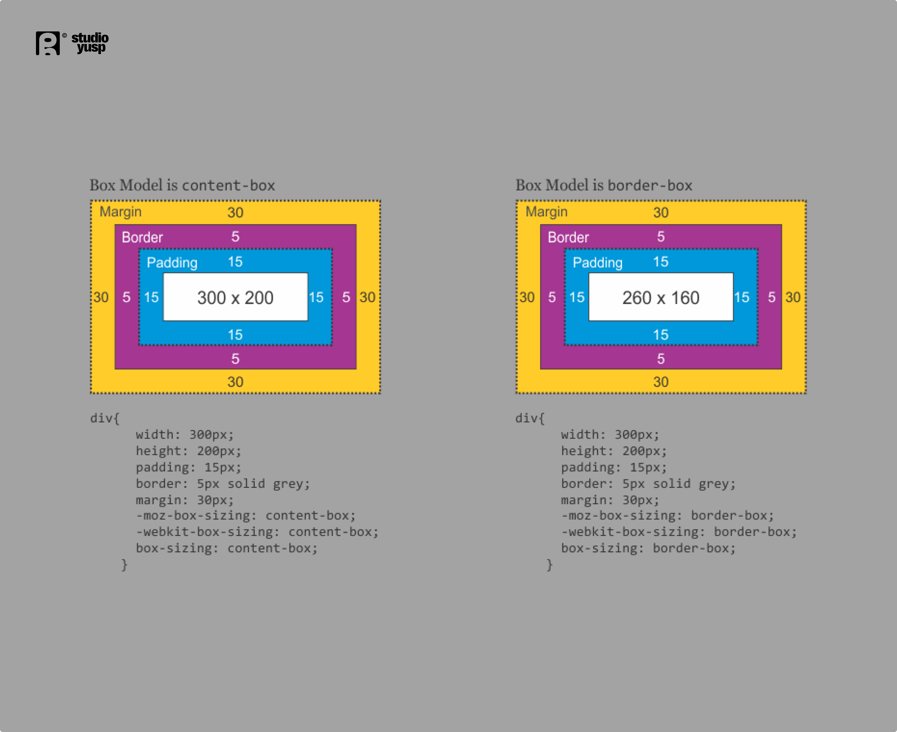
</p>

<div align="right">
    <b><a href="#">↥ back to top</a></b>
</div>

## Q. Trong CSS3, bạn sẽ chọn như thế nào?

* Mọi phần tử ```<a>``` có giá trị thuộc tính `href` bắt đầu bằng `“https”`.
```css
  a[href^="https"]
```
    
* Mọi phần tử ```<a>``` có giá trị thuộc tính `href` kết thúc bằng `“.pdf”`.
```css
  a[href$=".pdf"]
```
    
* Mọi phần tử ```<a>``` có giá trị thuộc tính `href` chứa chuỗi con `“css”`.
```css
  a[href*="css"]
```

<div align="right">
    <b><a href="#">↥ back to top</a></b>
</div>

## Q. Mục đích của thuộc tính kích thước hộp là gì?

<p align="center">
  
</p>

Thuộc tính CSS box-sizing đặt cách tính tổng chiều rộng và chiều cao của một phần tử.

* **content-box**: giá trị chiều rộng và chiều cao mặc định chỉ áp dụng cho nội dung của phần tử. Phần đệm và đường viền được thêm vào bên ngoài hộp.
* **padding-box**: Giá trị chiều rộng và chiều cao áp dụng cho nội dung của phần tử và phần đệm của nó. Đường viền được thêm vào bên ngoài hộp. Hiện tại, chỉ Firefox hỗ trợ giá trị hộp đệm.
* **border-box**: Giá trị chiều rộng và chiều cao áp dụng cho nội dung, phần đệm và đường viền.
* **inherit**: kế thừa kích thước hộp của phần tử cha.

**Example:**

```css
box-sizing: content-box;
width: 100%;
border: solid rgb(90,107,204) 10px;
padding: 5px;
```

<div align="right">
    <b><a href="#">↥ back to top</a></b>
</div>

## Q. Sự khác biệt giữa RGBa, HEX và HSLa là gì?

* **RGB** (Red/Green/Blue) là mẫu màu.

```css
p {
  color: rgba(37, 84, 127, 1);
}
```

* **HEX (Hexadecimal color values)**

```css
p {
  color: #25547f;
}
```

* **HSLa (Hue Saturation Lightness alpha)**

```css
p {
  color: hsla(209, 55%, 32%, 1);
}
```

<div align="right">
    <b><a href="#">↥ back to top</a></b>
</div>

## Q. Bộ tiền xử lý CSS là gì?

Bộ xử lý trước mở rộng CSS với các variables, operators, interpolations, funtions, mixin và nhiều nội dung có thể sử dụng khác. Sau khi phát triển, các tệp cụ thể này được biên dịch thành CSS thông thường mà bất kỳ trình duyệt nào cũng có thể hiểu được. Bộ tiền xử lý giúp viết các mã có thể tái sử dụng, dễ bảo trì và mở rộng trong CSS.

**CSS preprocessors:**

  * SASS (SCSS)
  * LESS
  * Stylus
  * PostCSS

**Thuận lợi:**

* CSS được làm cho dễ bảo trì hơn.
* Dễ dàng viết các bộ chọn lồng nhau.
* Các Variables cho chủ đề nhất quán. Có thể chia sẻ tập tin chủ đề trên các dự án khác nhau.
* Mixins để tạo CSS lặp lại.
* Chia mã của bạn thành nhiều tập tin. Các tệp CSS cũng có thể được chia nhỏ nhưng làm như vậy sẽ yêu cầu HTTP để tải xuống từng tệp CSS.

<div align="right">
    <b><a href="#">↥ back to top</a></b>
</div>

## Q.Sự khác biệt giữa CSS "resetting" và "normalizing" là gì?

**1. Resetting**: Đặt lại CSS nhằm mục đích loại bỏ tất cả kiểu dáng trình duyệt tích hợp. Ví dụ: lề, phần đệm, cỡ chữ của tất cả các thành phần được đặt lại giống nhau. Bạn sẽ phải khai báo lại kiểu dáng cho các thành phần kiểu chữ phổ biến.

**Example:**

```css
html, body, div, span, applet, object, iframe, h1, h2, h3, h4, h5, h6, p, blockquote, pre, a, abbr, 
acronym, address, big, cite, code, del, dfn, em, img, ins, kbd, q, s, samp, small, strike, strong, 
sub, sup, tt, var, b, u, i, center, dl, dt, dd, ol, ul, li, fieldset, form, label, legend, table, 
caption, tbody, tfoot, thead, tr, th, td, article, aside, canvas, details, embed,  figure, figcaption, 
footer, header, hgroup,  menu, nav, output, ruby, section, summary, time, mark, audio, video {  
   margin: 0;  
   padding: 0;  
   border: 0;  
   font-size: 100%;  
   font: inherit;  
   vertical-align: baseline; 
}
```

**2. Normalizing**: Chuẩn hóa CSS nhằm mục đích làm cho kiểu dáng trình duyệt tích hợp nhất quán trên các trình duyệt. Nó cũng sửa lỗi cho các phần phụ thuộc phổ biến của trình duyệt.

**Example:**

```css
/* 
  Correct the font size and margin on `h1` elements within `section`  
  and `article` contexts in Chrome, Firefox, and Safari.
*/
 h1 {  font-size: 2em;  margin: 0.67em 0;}
 ```

<div align="right">
    <b><a href="#">↥ back to top</a></b>
</div>

## Q. Giải thích CSS Block Formatting Context?

Floats, absolutely positioned elements, block containers (chẳng hạn như inline-blocks, table-cells, and table-captions) không phải làblock boxes và block boxes có 'overflow' ngoài 'visible' (trừ khi giá trị đó đã được truyền bá vào khung nhìn) thiết lập bối cảnh định dạng khối mới cho nội dung của chúng.

Trong ngữ cảnh định dạng block, cạnh ngoài bên trái của mỗi hộp chạm vào cạnh trái của container block (đối với định dạng từ phải sang trái, chạm vào cạnh phải)

BFC là một hộp HTML đáp ứng ít nhất một trong các điều kiện sau:

* Giá trị của `float` không phải là `none`.
* Giá trị của `position` không phải là `static` hay `relative`.
* Giá trị của `display` là `table-cell`, `table-caption`, `inline-block`, `flex` hoặc `inline-flex`.
* Giá trị của `overflow` không phải là `visible`.

Trong BFC, cạnh ngoài bên trái của mỗi hộp chạm vào cạnh trái của block containers (để định dạng từ phải sang trái, hãy chạm vào cạnh phải). Lề dọc giữa các hộp cấp khối liền kề khi thu gọn BFC.

**Example:**

```html
<!DOCTYPE html>
<html lang="en">
  <head>
    <title>CSS Block Formatting Context</title>
    <meta charset="utf-8" />
    <meta name="viewport" content="width=device-width, initial-scale=1" />
  </head>
  <style type="text/css">
    * {
      box-sizing: border-box;
    }

    body {
      margin: 40px;
      background-color: #fff;
      color: #444;
      font: 1.4em Arial, sans-serif;
    }

    .outer {
      background-color: #ccc;
      margin: 0 0 40px 0;
    }

    p {
      padding: 0;
      margin: 20px 0 20px 0;
      background-color: rgb(233, 78, 119);
      color: #fff;
    }

    .overflow {
      overflow: auto;
    }
  </style>
  <body>
    <h2>no BFC</h2>
    <div class="outer">
      <p>I am paragraph one and I have a margin top and bottom of 20px;</p>
      <p>I am paragraph two and I have a margin top and bottom of 20px;</p>
    </div>

    <h2>With a BFC</h2>

    <div class="outer overflow">
      <p>I am paragraph one and I have a margin top and bottom of 20px;</p>
      <p>I am paragraph two and I have a margin top and bottom of 20px;</p>
    </div>
  </body>
</html>
```

<div align="right">
    <b><a href="#">↥ back to top</a></b>
</div>

## Q. `overflow: hidden` có tạo bối cảnh định dạng Block mới không?

Đúng. Thuộc tính `overflow` xử lý nội dung nếu kích thước nội dung vượt quá kích thước được phân bổ cho nội dung. Bạn có thể hiển thị, ẩn, cuộn hoặc tự động nội dung bổ sung (hành vi mặc định của khung nhìn).

## Q. Bạn sẽ khắc phục các vấn đề về kiểu dáng dành riêng cho trình duyệt như thế nào?

* Sử dụng một biểu định kiểu riêng chỉ tải khi trình duyệt cụ thể đó đang được sử dụng. Tuy nhiên, kỹ thuật này yêu cầu kết xuất phía máy chủ.
* Sử dụng `autoprefixer` để tự động thêm tiền tố của nhà cung cấp vào mã của bạn.
* Sử dụng Đặt lại CSS hoặc Normalize.css.

```css
/*Example: 01*/
.box-shadow {
  background-color: red;
  background-image: url(gradient-slice.png);
  background-image: -webkit-linear-gradient(top right, #A60000, #FFFFFF); /*Chrome and Safari*/
  background-image: -moz-linear-gradient(top right, #A60000, #FFFFFF); 	  /*Firefox*/
  background-image: -ms-linear-gradient(top right, #A60000, #FFFFFF);     /*Internet Explorer*/
  background-image: -o-linear-gradient(top right, #A60000, #FFFFFF);      /*Opera*/
  background-image: linear-gradient(top right, #A60000, #FFFFFF);
}

/*Example: 02*/
.box {
	-moz-border-radius: 15px;    /* Firefox */
	-webkit-border-radius: 15px; /* Safari and Chrome */
	border-radius: 15px;
}
```

<div align="right">
    <b><a href="#">↥ back to top</a></b>
</div>

## Q. Kỹ thuật image replacement là gì và sử dụng kỹ thuật nào khi nào?

**Kỹ thuật: 01:**

```css
h1#technique-one {
  width: 250px;
  height: 25px;
  background-image: url(logo.gif);
}
h1#technique-one span {
  display: none;
}
```

```html
<h1 id="technique-one">
  <span>CSS-Tricks</span>
</h1>
```

**Kỹ thuật: 02:**

```css
h1.technique-two {
  width: 2350px; 
  height: 75px;
  background: url("images/header-image.jpg") top right;
  margin: 0 0 0 -2000px;
}
```

```html
<h1 class="technique-two">
  CSS-Tricks
</h1>
```

**Kỹ thuật: 03:**

```css
h1.technique-three {
  width: 350px; 
  height: 75px;
  background: url("images/header-image.jpg");
  text-indent: -9999px;
}
```

```html
<h1 class="technique-three">
  CSS-Tricks
</h1>
```

**Kỹ thuật: 04:**

```css
h1.technique-four {
	width: 350px; 
  height: 75px;
	background: url("images/header-image.jpg");
	text-indent: -9999px;
}
```
```html
<h1 class="technique-four">
  <a href="#">
    
  </a>
</h1>
```

**Kỹ thuật: 05:**

```css
h1.technique-five {
	width: 350px; 
  height: 75px;
	background: url("images/header-image.jpg");
}
h1.technique-five span {
  display: none;
}
```

```html
<h1 class="technique-five">
  
  <span>CSS-Tricks</span>
</h1>
```

**Kỹ thuật: 06:**

```css
h1.technique-six {
	width: 350px;
	padding: 75px 0 0 0;
	height: 0;
	background: url("images/header-image.jpg") no-repeat;
	overflow: hidden;
}
```

```html
<h1 class="technique-six">
  CSS-Tricks
</h1>
```

**Kỹ thuật: 07:**

```css
h1.technique-seven {
	width: 350px; 
  height: 75px;
	background: url("images/header-image.jpg") no-repeat;
}
h1.technique-seven span {
  display: block;
  width: 0;
  height: 0;
  overflow: hidden;
}
```

```html
<h1 class="technique-seven">
	<span>CSS-Tricks</span>
</h1>
```

**Kỹ thuật: 08:**

```css
h1.technique-eight {
	width: 350px; 
  height: 75px;
	position: relative;
}
h1.technique-eight span {
  background: url("images/header-image.jpg");
  position: absolute;
  width: 100%;
  height: 100%;
}
```

```html
<h1 class="technique-eight">
  <span></span>CSS-Tricks
</h1>
```

**Kỹ thuật: 09:**

```css
h1.technique-nine {
  width: 350px; 
  height: 75px;
  background: url("images/header-image.jpg") no-repeat;
  font-size: 1px;
  color: white;
}
```

```html
<h1 class="technique-nine">
  CSS-Tricks
</h1>
```

<div align="right">
    <b><a href="#">↥ back to top</a></b>
</div>

## Q. Media queries là gì? Ap dụng các quy tắc css cụ thể cho một Media như thế nào?

Media queries rất hữu ích khi bạn muốn sửa đổi trang web hoặc ứng dụng của mình tùy thuộc vào loại chung của thiết bị (chẳng hạn như in so với màn hình) hoặc các đặc điểm và thông số cụ thể (chẳng hạn như độ phân giải màn hình hoặc chiều rộng khung nhìn của trình duyệt). Nó sử dụng quy tắc @media để chỉ bao gồm một khối thuộc tính CSS nếu một điều kiện nhất định là đúng.

**Media Types:**

|STT| Giá trị | Mô tả          |
|------|-------|---------------------|
|  01. |all	   |Mặc định. Được sử dụng cho tất cả các thiết bị loại phương tiện|
|  02. |print	 |Được sử dụng cho máy in|
|  03. |screen |Được sử dụng cho màn hình máy tính, máy tính bảng, điện thoại thông minh, v.v.|
|  04. |speech |Được sử dụng cho các trình đọc màn hình "đọc" trang thành tiếng|

**Media Features:**  

|STT| Giá trị | Mô tả          |
|------|-----------------|----------------------|  
| 01.  |any-hover	       | Bất kỳ cơ chế nhập lực nào có sẵn có cho phép người dùng di chuột qua các phần tử không? |
| 02.  |any-pointer	     | Bất kỳ cơ chế nhập lực nào có sẵn có phải là thiết bị trỏ không và nếu có, nó chính xác như thế nào? |
| 03.  |aspect-ratio	   | Tỷ lệ giữa chiều rộng và chiều cao của vùng nhìn|
| 04.  |color	           | Số bit trên mỗi thành phần màu cho thiết bị đầu ra|
| 05.  |color-gamut	     | Phạm vi màu gần đúng được hỗ trợ bởi trình duyệt người dùng và thiết bị đầu ra|
| 06.  |color-index	     | Số lượng màu mà thiết bị có thể hiển thị|
| 07.  |grid	           | Thiết bị là lưới hay bitmap|
| 08.  |height	         | Chiều cao vùng nhìn|
| 09.  |hover	           | Cơ chế nhập lực chính có cho phép người dùng di chuột qua các phần tử không? |
| 10.  |inverted-colors	 | Trình duyệt hoặc hệ điều hành cơ bản có đảo ngược màu không? |
| 11.  |light-level	     | Mức độ ánh sáng xung quanh hiện tại |
| 12.  |max-aspect-ratio |	Tỷ lệ tối đa giữa chiều rộng và chiều cao của khu vực hiển thị|
| 13.  |max-color	       | Số bit tối đa trên mỗi thành phần màu cho thiết bị đầu ra|
| 14.  |max-color-index	 | Số lượng màu tối đa mà thiết bị có thể hiển thị|
| 15.  |max-height	     | Chiều cao tối đa của khu vực hiển thị, chẳng hạn như cửa sổ trình duyệt|
| 16.  |max-monochrome	 | Số bit tối đa trên mỗi "màu" trên thiết bị đơn sắc (thang độ xám)|
| 17.  |max-resolution	 | Độ phân giải tối đa của thiết bị, sử dụng dpi hoặc dpcm|
| 18.  |max-width	       | Chiều rộng tối đa của khu vực hiển thị, chẳng hạn như cửa sổ trình duyệt|
| 19.  |min-aspect-ratio | Tỷ lệ tối thiểu giữa chiều rộng và chiều cao của khu vực hiển thị|
| 20.  |min-color	       | Số bit tối thiểu trên mỗi thành phần màu cho thiết bị đầu ra|
| 21.  |min-color-index	 | Số lượng màu tối thiểu mà thiết bị có thể hiển thị|
| 22.  |min-height	     | Chiều cao tối thiểu của khu vực hiển thị, chẳng hạn như cửa sổ trình duyệt|
| 23.  |min-monochrome	 | Số bit tối thiểu trên mỗi "màu" trên thiết bị đơn sắc (thang độ xám)|
| 24.  |min-resolution	 | Độ phân giải tối thiểu của thiết bị, sử dụng dpi hoặc dpcm|
| 25.  |min-width	       | Chiều rộng tối thiểu của khu vực hiển thị, chẳng hạn như cửa sổ trình duyệt|
| 26.  |monochrome	     | Số bit trên mỗi "màu" trên thiết bị đơn sắc (thang độ xám)|
| 27.  |orientation	     | Hướng của vùng nhìn (chế độ ngang hoặc dọc)|
| 28.  |overflow-block	 | Thiết bị đầu ra xử lý nội dung tràn ra khỏi vùng nhìn dọc theo trục khối như thế nào| 
| 29.  |overflow-inline	 | Có thể cuộn nội dung tràn ra khỏi vùng nhìn dọc theo trục nội tuyến không |
| 30.  |pointer	         | Cơ chế nhập lực chính có phải là thiết bị trỏ không và nếu có, nó chính xác như thế nào? |
| 31.  |resolution	     | Độ phân giải của thiết bị đầu ra, sử dụng dpi hoặc dpcm|
| 32.  |scan	           | Quá trình quét của thiết bị đầu ra|
| 33.  |scripting	       | Có sẵn script (ví dụ: JavaScript) không? |
| 34.  |update	         | Thiết bị đầu ra có thể thay đổi diện mạo của nội dung nhanh chóng như thế nào? |
| 35.  |width	           | Chiều rộng vùng nhìn |


**Example:**

```css
@media print {
  body { font-size: 10pt; }
}

@media screen {
  body { font-size: 13px; }
}

@media only screen and (max-width: 600px) {
  body {
    background-color: lightblue;
  }
}

/* Nested within another conditional at-rule */
@supports (display: flex) {
  @media screen and (min-width: 900px) {
    article {
      display: flex;
    }
  }
}

/* Extra small devices (phones, 600px and down) */
@media only screen and (max-width: 600px) { }

/* Small devices (portrait tablets and large phones, 600px and up) */
@media only screen and (min-width: 600px) { }

/* Medium devices (landscape tablets, 768px and up) */
@media only screen and (min-width: 768px) { }

/* Large devices (laptops/desktops, 992px and up) */
@media only screen and (min-width: 992px) { }

/* Extra large devices (large laptops and desktops, 1200px and up) */
@media only screen and (min-width: 1200px) { }
```

<div align="right">
    <b><a href="#">↥ back to top</a></b>
</div>

## Q. Công dụng của `@media only screen` là gì?

Nó ẩn các biểu định kiểu khỏi các tác nhân người dùng cũ hơn.

## Q. Từ khóa `screen` có áp dụng cho màn hình vật lý của thiết bị hoặc chế độ xem của trình duyệt không?

Browser\'s Viewport

## Q. Triển khai một bộ thiết kế web sử dụng phông chữ không chuẩn như thế nào?

Sử dụng `@font-face` và xác định `font-family` cho các `font-weight` khác nhau.

## Q. Làm cách nào trình duyệt xác định thành phần nào khớp với bộ chọn CSS?

Trình duyệt khớp với bộ chọn từ ngoài cùng bên phải (bộ chọn phím) sang trái. Trình duyệt lọc các phần tử trong DOM theo bộ chọn khóa và duyệt qua các phần tử gốc của nó để xác định kết quả khớp. Độ dài của chuỗi bộ chọn càng ngắn thì trình duyệt có thể xác định xem phần tử đó có khớp với bộ chọn càng nhanh hay không.

Ví dụ: với bộ chọn `p span` này, trước tiên các trình duyệt sẽ tìm tất cả các phần tử `<span>` và duyệt lên phần tử gốc của nó đến gốc để tìm phần tử `<p>`. Đối với một `<span>` cụ thể, ngay khi tìm thấy `<p>`, nó biết rằng `<span>` khớp và có thể ngừng khớp.
.
<div align="right">
    <b><a href="#">↥ back to top</a></b>
</div>

## Q. Làm thế nào để có thể tải tài nguyên css có điều kiện?

**@import**: cho phép tải biểu định kiểu bằng cách sử dụng đường dẫn (uri) biểu thị vị trí của tệp.

```css
/* By default, include the "light" color theme for syntax highlighting */
@import "cdn.com/atom-one-light.min.css";
/* And if you’re in dark mode, have those rules superseded via a different stylesheet */
@media (prefers-color-scheme: dark) {
  @import "cdn.com/atom-one-dark.min.css";
}
```

**matchMedia()**: Việc sử dụng matchMedia cho phép bạn chỉ thực thi các khối JavaScript khi đáp ứng một điều kiện media query nhất định. Điều này có nghĩa là bạn chỉ có thể viết CSS khi và nếu truy vấn đúng:

```javascript
if (window.matchMedia('screen and (min-width: 600px)')) {
  document.write('<link rel="stylesheet" href="css/small.css">');
}
```

<div align="right">
    <b><a href="#">↥ back to top</a></b>
</div>

## Q. `* { box-sizing: border-box; }` làm gì? Ưu điểm của nó là gì?

* Làm cho mọi phần tử trong tài liệu bao gồm phần đệm và đường viền theo kích thước bên trong của phần tử;
giúp dễ dàng suy luận về cách bố trí các thành phần trên trang.
* Theo mặc định, các thành phần được áp dụng `box-sizing: content-box` và chỉ kích thước nội dung mới được tính.
* `box-sizing: border-box` thay đổi cách tính `width` và `height` của các phần tử, `border` và `padding` cũng được đưa vào tính toán.
* Hiện tại, `height` của một phần tử được tính bằng `height` + `padding` dọc + `border` dọc của nội dung.
* `width` của một phần tử hiện được tính bằng `width` + `padding` ngang + `border` ngang của nội dung.
* Việc tính đến `padding` và `border` như một phần của mô hình hộp của chúng tôi sẽ tạo ra sự cộng hưởng tốt hơn với cách các nhà thiết kế thực sự tưởng tượng ra nội dung trong lưới.

<div align="right">
    <b><a href="#">↥ back to top</a></b>
</div>

## Q. Liệt kê thuộc tính hiển thị trong CSS?

Thuộc tính display chỉ định hành vi hiển thị (loại hộp kết xuất) của một phần tử.

**Example:**

```css
p.ex1 {display: none;}
p.ex2 {display: inline;}
p.ex3 {display: block;}
p.ex4 {display: inline-block;}
```

**Property Values:**

|STT| Giá trị	   |Mô tả|	
|-----|---------------|------------------
| 01. |inline	|Displays an element as an inline element (like `<span>`). Any height and width properties will have no effect|	
| 02. |block	|Displays an element as a block element (like `<p>`). It starts on a new line, and takes up the whole width	|
| 03. |contents|Makes the container disappear, making the child elements children of the element the next level up in the DOM	|
| 04. |flex	          |Displays an element as a block-level flex container	|
| 05. |grid	          |Displays an element as a block-level grid container	|
| 06. |inline-block   |Displays an element as an inline-level block container. The element itself is formatted as an inline element, but you can apply height and width values|	
| 07. |inline-flex	   |Displays an element as an inline-level flex container	|
| 08. |inline-grid	   |Displays an element as an inline-level grid container	|
| 09. |inline-table    |The element is displayed as an inline-level table	|
| 10. |list-item	     |Let the element behave like a `<li>` element	|
| 11. |run-in	         |Displays an element as either block or inline, depending on context	|
| 12. |table	         |Let the element behave like a `<table>` element	|
| 13. |table-caption	 |Let the element behave like a `<caption>` element	|
| 14. |table-column-group	|Let the element behave like a `<colgroup>` element	|
| 15. |table-header-group	|Let the element behave like a `<thead>` element	|
| 16. |table-footer-group	|Let the element behave like a `<tfoot>` element	|
| 17. |table-row-group	  |Let the element behave like a `<tbody>` element	|
| 18. |table-cell	        |Let the element behave like a `<td>` element	|
| 19. |table-column	      |Let the element behave like a `<col>` element	|
| 20. |table-row	        |Let the element behave like a `<tr>` element	|
| 21. |none	              |The element is completely removed	|
| 22. |initial	          |Sets this property to its default value. Read about initial	|
| 23. |inherit	          |Inherits this property from its parent element. Read about inherit|

<div align="right">
    <b><a href="#">↥ back to top</a></b>
</div>

## Q. Thiết kế responsive khác với thiết kế adaptive như thế nào?

**1) Responsive design** sử dụng `CSS media queries` để thay đổi kiểu dựa trên thiết bị đích như loại hiển thị, chiều rộng, chiều cao, v.v. và chỉ một trong số này là cần thiết để trang web thích ứng với các màn hình khác nhau.

Responsive không cung cấp nhiều quyền kiểm soát như Adaptive nhưng tốn ít công sức hơn để xây dựng và bảo trì. Bố cục đáp ứng cũng linh hoạt và trong khi khả năng thích ứng có thể và sử dụng tỷ lệ phần trăm để mang lại cảm giác linh hoạt hơn khi chia tỷ lệ, những điều này lại có thể gây ra bước nhảy khi cửa sổ được thay đổi kích thước.

**2) Adaptive design** ** sử dụng bố cục tĩnh dựa trên các điểm ngắt không phản hồi khi chúng được tải lần đầu. Tính năng thích ứng hoạt động để phát hiện kích thước màn hình và tải bố cục phù hợp cho màn hình đó.

Nói chung, trang web thích ứng sử dụng sáu độ rộng màn hình phổ biến::

* 320 px
* 480 px
* 760 px
* 960 px
* 1200 px
* 1600 px

Adaptive rất hữu ích trong việc trang bị thêm trang web hiện có để làm cho trang web đó thân thiện hơn với thiết bị di động. Điều này cho phép bạn kiểm soát thiết kế và phát triển cho nhiều khung nhìn cụ thể.

<div align="right">
    <b><a href="#">↥ back to top</a></b>
</div>

## Q. Đồ họa retina là gì? Loại kỹ thuật nào để xử lý hình ảnh cho màn hình retina?

Để có đồ họa sắc nét, đẹp mắt giúp phát huy tối đa màn hình retina, chúng ta cần sử dụng hình ảnh có độ phân giải cao bất cứ khi nào có thể. Tuy nhiên, việc luôn sử dụng hình ảnh có độ phân giải cao nhất sẽ ảnh hưởng đến hiệu suất vì sẽ cần gửi nhiều byte hơn qua đường truyền.

Để khắc phục vấn đề này, chúng ta có thể sử dụng hình ảnh phản hồi, như được chỉ định trong HTML5. Nó yêu cầu cung cấp các tệp có độ phân giải khác nhau của cùng một hình ảnh cho trình duyệt và để trình duyệt quyết định hình ảnh nào là tốt nhất, ví dụ: sử dụng thuộc tính html `srcset` và `sizes` tùy chọn:

```html
<div responsive-background-image>  
  
</div>

<!-- Nó cho phép trình duyệt sử dụng hình ảnh vừa và lớn dựa trên
     kích thước của hình ảnh trong khung nhìn
-->

```

Các trình duyệt không hỗ trợ `srcset` của HTML5 (tức là IE11) sẽ bỏ qua nó và thay vào đó sử dụng `src`. Nếu chúng tôi thực sự cần hỗ trợ IE11 và chúng tôi muốn cung cấp tính năng này vì lý do hiệu suất, chúng tôi có thể sử dụng `polyfill` JavaScript.

**HTML5 picture Element:**

```html
<picture>
   <source media="(min-width: 1024px)" srcset="foo-large.jpg  1024w, foo-medium.jpg 640w" sizes="50vw" />
   <source srcset="foo@2x.jpg 2x, foo.jpg 1x" />
   
</picture>
```

**Retina Display Media Query:**

```css
/* 1.25 dpr */
@media (-webkit-min-device-pixel-ratio: 1.25), (min-resolution: 120dpi) { 
    /* Retina-specific stuff here */
}

/* 1.3 dpr */
@media (-webkit-min-device-pixel-ratio: 1.3), (min-resolution: 124.8dpi) { 
    /* Retina-specific stuff here */
}

/* 1.5 dpr */
@media (-webkit-min-device-pixel-ratio: 1.5), (min-resolution: 144dpi) { 
    /* Retina-specific stuff here */
}
```

<div align="right">
    <b><a href="#">↥ back to top</a></b>
</div>

## Q. Có lý do nào để sử dụng Translate() thay vì Position hoặc ngược lại không?

`translate()` là một giá trị của CSS `transform`. Thay đổi `transform` hoặc `opacity` không kích hoạt reflow hoặc repaint của trình duyệt nhưng kích hoạt các compositions; trong khi thay đổi vị trí tuyệt đối kích hoạt `reflow`. `transform` khiến trình duyệt tạo lớp GPU cho phần tử nhưng thay đổi thuộc tính định vị tuyệt đối sử dụng CPU. Do đó, `translate()` hiệu quả hơn và sẽ tạo ra thời gian vẽ ngắn hơn cho các hoạt ảnh mượt mà hơn.

Khi sử dụng `translate()`, phần tử vẫn chiếm không gian ban đầu của nó (giống như `position: relative`), không giống như khi thay đổi vị trí tuyệt đối.

**Example:**

Nếu chúng ta kết hợp `position: relative` với một trong các thuộc tính offset `top`, `bottom`, `left` hoặc `right` thì phần tử sẽ được di chuyển khỏi vị trí ban đầu trong bố cục trong khi vẫn giữ nguyên khoảng trắng trong tài liệu một lần chiếm lĩnh. Phần tử sẽ được chuyển sang một lớp mới và sau đó “thứ tự lớp” hoặc thứ tự xếp chồng của nó có thể được kiểm soát bằng thuộc tính `z-index`.

```css
.thing {
  position: relative;
  top: 100px;
  left: 50px;
}
```

Trong ví dụ trên, phần tử sẽ được di chuyển cách xa `100px` so với trên cùng và `50px` so với bên trái vị trí ban đầu của nó.

Khi sử dụng `transform:translate(x,y)`, chúng tôi nhận được kết quả trực quan rất giống với việc sử dụng vị trí tương đối. Kết quả tương tự như trên có thể đạt được với đoạn mã sau:

```css
.thing {
  transform: translate(50px, 100px);
}
```

Trong trường hợp này, chúng tôi đang dịch tọa độ của phần tử theo `50px` dọc theo trục x và `100px` dọc theo trục y. Kết quả cuối cùng trông giống như ví dụ `position` trước đó.

<div align="right">
    <b><a href="#">↥ back to top</a></b>
</div>

## Q. Hàm `translate()` có thể di chuyển vị trí của một phần tử trên trục z không?

* Không

## Q. Cho biết từng thẻ này có tác dụng gì, nếu có các lựa chọn thay thế, thẻ nào thích hợp hơn, tại sao?

**`<em>`**: Thẻ HTML `<em>` thể hiện sự nhấn mạnh vào nội dung của nó.

```html
<em>Emphasized content...</em>
```

**`<b>`**: Thẻ `<b>` chỉ định văn bản in đậm mà không có thêm bất kỳ tầm quan trọng nào.

```html
<p>This is normal text - <b>and this is bold text</b>.</p>
```

**`<abbr>`**: Phần tử Viết tắt HTML (`<abbr>`) đại diện cho một từ viết tắt hoặc từ viết tắt; thuộc tính tiêu đề tùy chọn có thể cung cấp phần mở rộng hoặc mô tả cho từ viết tắt.

```html
The <abbr title="World Health Organization">WHO</abbr> was founded in 1948.
```

**`<nav>`**: Thẻ `<nav>` xác định một tập hợp các liên kết điều hướng.

```html
<nav>
  <a href="/html/">HTML</a> |
  <a href="/css/">CSS</a> |
  <a href="/js/">JavaScript</a> |
  <a href="/jquery/">jQuery</a>
</nav>
```

**`<i>`**: Nội dung của thẻ `<i>` thường được hiển thị ở dạng in nghiêng.

```html
<p>I looked at it and thought <i>This can't be real!</i></p>
```

**`<link>`**: Thẻ HTML `<link>` được sử dụng để xác định liên kết đến tài nguyên bên ngoài. Nó được đặt trong phần `<head>` của tài liệu HTML.

```html
<head>
  <link rel="stylesheet" type="text/css" href="theme.css">
</head>
```

**`<strong>`**: Phần tử `<strong>` được sử dụng để xác định văn bản có tầm quan trọng lớn hơn văn bản xung quanh. Theo mặc định, tất cả các trình duyệt hiển thị văn bản `<strong>` bằng kiểu chữ in đậm.

```html
<strong>Strong text</strong>
```

**`<article>`**: Thẻ `<article>` chỉ định nội dung độc lập, khép kín.

```html
<article>
  <h1>Google Chrome</h1>
  <p>Google Chrome is a free, open-source web browser developed by Google, released in 2008.</p>
</article>
```

<div align="right">
    <b><a href="#">↥ back to top</a></b>
</div>

## Q. At-Rule là gì?

At-rules là `các câu lệnh CSS` hướng dẫn CSS cách hành xử. Chúng bắt đầu bằng ký hiệu at, `@`, theo sau là mã định danh và bao gồm mọi thứ cho đến dấu chấm phẩy tiếp theo, `;` hoặc khối CSS tiếp theo, tùy điều kiện nào đến trước.

```css
/* Cấu trúc chung */
@IDENTIFIER (RULE);

/* Example: yêu cầu trình duyệt sử dụng bộ ký tự UTF-8 */
@charset "utf-8";
```

|Sl.No| at-rules  | Description |
|-----|-----------|-------------|
| 01. |@charset   |Xác định bộ ký tự được sử dụng bởi bảng kiểu.|
| 02. |@import    |Yêu cầu trình tạo CSS bao gồm một bảng kiểu bên ngoài.|
| 03. |@namespace |Thông báo cho trình tạo CSS rằng tất cả nội dung của nó phải được coi là có tiền tố với không gian tên XML.|
| 04. |@media     |Một quy tắc nhóm điều kiện sẽ áp dụng nội dung của nó nếu thiết bị đáp ứng các tiêu chí của điều kiện được xác định bằng media query.|
| 05. |@supports  |Một quy tắc nhóm điều kiện sẽ áp dụng nội dung của nó nếu trình duyệt đáp ứng các tiêu chí của điều kiện đã cho.|
| 06. |@page      |Mô tả khía cạnh của các thay đổi bố cục sẽ được áp dụng khi in tài liệu.|
| 07. |@font-face |Mô tả khía cạnh của phông chữ bên ngoài sẽ được tải xuống.|
| 08. |@keyframes |Mô tả khía cạnh của các bước trung gian trong chuỗi hoạt ảnh CSS.|

<div align="right">
    <b><a href="#">↥ back to top</a></b>
</div>

## Q. Làm thế nào có thể loại bỏ khoảng trống dưới hình ảnh?

Vì hình ảnh là thành phần nội tuyến được xử lý giống như văn bản nên vẫn còn một khoảng trống, có thể được xóa bằng cách:

```html
<figure>
  
</figure>
```

<div align="right">
    <b><a href="#">↥ back to top</a></b>
</div>

## Q. Progressive rendering là gì?

Progressive rendering là tên được đặt cho các kỹ thuật được sử dụng để cải thiện hiệu suất của trang web (cụ thể là cải thiện thời gian tải được cảm nhận) nhằm hiển thị nội dung để hiển thị nhanh nhất có thể.

**Examples:**

* **Lazy loading of images** - Hình ảnh trên trang không được tải cùng một lúc. JavaScript sẽ được sử dụng để tải hình ảnh khi người dùng cuộn vào phần trang hiển thị hình ảnh.
* **Prioritizing visible content (or above-the-fold rendering)** - Chỉ bao gồm CSS/nội dung/tập lệnh tối thiểu cần thiết cho số lượng trang sẽ được hiển thị trong trình duyệt của người dùng trước để hiển thị nhanh nhất có thể, sau đó bạn có thể sử dụng tập lệnh bị trì hoãn hoặc lắng nghe sự kiện DOMContentLoaded/load để tải trong các tài nguyên khác và nội dung.
* **Async HTML fragments** - Đưa các phần của HTML vào trình duyệt khi trang được xây dựng ở back end.

<div align="right">
    <b><a href="#">↥ back to top</a></b>
</div>

## Q. Mobile-first là gì? Sự khác biệt giữa việc mã hóa trang web để có tính phản hồi cao so với việc sử dụng chiến lược mobile-first không?

Làm cho trang web phản hồi nhanh có nghĩa là một số thành phần sẽ phản hồi bằng cách điều chỉnh kích thước của trang web hoặc chức năng khác theo kích thước màn hình của thiết bị, điển hình là chiều rộng khung nhìn, thông qua các media queries CSS, chẳng hạn như làm cho kích thước phông chữ nhỏ hơn trên các thiết bị nhỏ hơn.

```css
@media (min-width: 601px) {
  .my-class {
    font-size: 24px;
  }
}
@media (max-width: 600px) {
  .my-class {
    font-size: 12px;
  }
}
```

Chiến lược mobile-first cũng mang tính đáp ứng, tuy nhiên, chiến lược này đồng ý rằng chúng ta nên mặc định và xác định tất cả kiểu cho thiết bị di động và chỉ thêm các quy tắc phản hồi cụ thể cho các thiết bị khác sau này. Theo ví dụ trước:

```css
.my-class {
  font-size: 12px;
}

@media (min-width: 600px) {
  .my-class {
    font-size: 24px;
  }
}
```

mobile-first có 2 ưu điểm chính:

* Nó hoạt động hiệu quả hơn trên thiết bị di động vì tất cả các quy tắc được áp dụng cho chúng không cần phải được xác thực đối với bất kỳ truy vấn phương tiện nào.
* Nó buộc phải viết mã sạch hơn theo các quy tắc CSS đáp ứng.

**Example:**

```html
<!DOCTYPE html>
<html>
  <head>
  <meta name="viewport" content="width=device-width, initial-scale=1.0">
  <title>CSS Media Query</title>
  <style>
    body {
        background-color: lightgreen;
    }

    @media only screen and (max-width: 800px) {
        body {
            background-color: rgb(233, 50, 18);
        }
    }
  </style>
  </head>
<body>
    <h1>Resize the browser window</h1>
    <h2>When the width of this document is 800px or less, the background-color is "green", 
      otherwise it is "Red".</h2>
</body>
</html>
```


<div align="right">
    <b><a href="#">↥ back to top</a></b>
</div>


## Q. Làm cách nào để khôi phục giá trị mặc định của thuộc tính?

Từ khóa `initial` có thể được sử dụng để đặt lại nó về giá trị mặc định, được xác định trong đặc tả CSS của thuộc tính đã cho.

<div align="right">
    <b><a href="#">↥ back to top</a></b>
</div>

## Q. Tính đặc hiệu là gì?

Quá trình xác định quy tắc css nào sẽ được áp dụng cho một phần tử. Nó thực sự xác định quy tắc nào sẽ được ưu tiên. Kiểu Inline thường thắng sau đó là ID rồi đến giá trị class (hoặc pseudo-class hoặc bộ chọn thuộc tính), bộ chọn phổ quát (*) không có tính đặc hiệu. Bộ chọn ID có độ đặc hiệu cao hơn bộ chọn thuộc tính.

**Selector Types**  

Danh sách các loại bộ chọn sau đây tăng theo độ đặc hiệu:

* **Type selectors** (ví dụ: h1) và các phần tử giả (ví dụ: ::before).
* **Class selectors** (ví dụ: .example), bộ chọn thuộc tính (ví dụ: [type="radio"]) và các lớp giả (ví dụ: :hover).
* **ID selectors** (ví dụ: #example).

```css
/*wins*/
a#a-02 { background-image : url(n.gif); }
a[id="a-02"] { background-image : url(n.png); }
```

Bộ chọn theo ngữ cảnh cụ thể hơn bộ chọn phần tử đơn lẻ. Biểu định kiểu được nhúng gần với phần tử được tạo kiểu hơn. Quy tắc cuối cùng được xác định sẽ ghi đè mọi quy tắc xung đột trước đó.

```css
p { color: red; background: yellow }
p { color: green } // wins
```

Bộ chọn lớp đánh bại bất kỳ số lượng bộ chọn phần tử nào.

```css
.introduction {} // wins
html body div div h2 p {}
```

<div align="right">
    <b><a href="#">↥ back to top</a></b>
</div>

## Q. CSS Transitions?

**CSS Transitions** cho phép thêm hiệu ứng trong khi thay đổi từ kiểu này sang kiểu khác. Bạn có thể đặt thuộc tính nào bạn muốn chuyển đổi, thời lượng, cách bạn muốn chuyển tiếp (linear, ease, ease-in, ease-out, cubic-bezier) và độ trễ khi quá trình chuyển đổi sẽ bắt đầu.

**CSS Transition Properties**  

|STT| Giá trị	   |Mô tả|	
|-----|---------------------------|-----------------------------------|
| 01. |transition	                |Thuộc tính viết tắt để đặt bốn thuộc tính chuyển đổi thành một thuộc tính duy nhất|
| 02. |transition-delay	          |Chỉ định độ trễ (tính bằng giây) cho hiệu ứng chuyển đổi|
| 03. |transition-duration	      |Chỉ định hiệu ứng chuyển đổi mất bao nhiêu giây hoặc mili giây để hoàn tất|
| 04. |transition-property	      |Chỉ định tên của thuộc tính CSS mà hiệu ứng chuyển đổi dành cho|
| 05. |transition-timing-function	|Chỉ định đường cong tốc độ của hiệu ứng chuyển đổi|

**Example: 01**

```css
div {
  width: 100px;
  height: 100px;
  background: red;
  -webkit-transition: width 2s; /* Safari prior 6.1 */
  transition: width 2s;
}
```

<div align="right">
    <b><a href="#">↥ back to top</a></b>
</div>

## Q. CSS Filters?

Thuộc tính CSS bộ lọc áp dụng các hiệu ứng đồ họa như blur hoặc color shift cho một phần tử. Bộ lọc thường được sử dụng để điều chỉnh hiển thị images, backgrounds, và borders.

**Example:**

```css
img {
  -webkit-filter: brightness(200%); /* Safari 6.0 - 9.0 */
  filter: brightness(200%);
}
```
**Filter Functions**  

|STT| Giá trị	   |Mô tả|	
|-----|--------------|-----------------------------------|
| 01. |none	         |Giá trị mặc định. Chỉ định không có hiệu ứng|
| 02. |blur(px)	     |Áp dụng hiệu ứng mờ cho hình ảnh. Giá trị lớn hơn sẽ tạo ra độ mờ lớn hơn.|
| 03. |brightness(%) |Điều chỉnh độ sáng của hình ảnh.|
| 04. |contrast(%)	 |Điều chỉnh độ tương phản của hình ảnh.|
| 05. |drop-shadow(h-shadow v-shadow blur spread color)|Áp dụng hiệu ứng đổ bóng cho hình ảnh.|
| 06. |grayscale(%)	 |Chuyển đổi hình ảnh thành thang độ xám.|
| 07. |hue-rotate(deg)|Áp dụng xoay màu cho hình ảnh. Giá trị xác định số độ xung quanh vòng tròn màu|
| 08. |invert(%)	   |Đảo ngược các mẫu trong hình ảnh.|
| 09. |opacity(%)	   |Thiết lập mức độ mờ cho hình ảnh. Mức độ mờ mô tả mức độ trong suốt|
| 10. |saturate(%)	 |Làm cho hình ảnh bão hòa hơn.|
| 11. |sepia(%)	     |	Chuyển đổi hình ảnh thành màu nâu đỏ.|
| 12. |url()	       |Hàm url() lấy vị trí của tệp XML xác định bộ lọc SVG và có thể bao gồm một neo tới phần tử bộ lọc cụ thể. Ví dụ: `filter: url(svg-url#element-id)`|
| 13. |initial	     |Thiết lập thuộc tính này về giá trị mặc định của nó.|
| 14. |inherit	     |Kế thừa thuộc tính này từ phần tử cha của nó.|

<div align="right">
    <b><a href="#">↥ back to top</a></b>
</div>


<div align="right">
    <b><a href="#">↥ back to top</a></b>
</div>

## Q. CSS Background?


|  Thuộc tính             | Mô tả                               |
|-----------------------|-------------------------------------------|
|background-color	      |Chỉ định màu nền sẽ được sử dụng	|
|background-image	      |Chỉ định MỘT hoặc NHIỀU hình ảnh nền sẽ được sử dụng	|
|background-position	  |Chỉ định vị trí của các hình ảnh nền	|
|background-size	      |Chỉ định kích thước của các hình ảnh nền	|
|background-repeat	    |Chỉ định cách lặp lại các hình ảnh nền	|
|background-origin	    |Chỉ định khu vực định vị của các hình ảnh nền|
|background-clip	      |Chỉ định khu vực sơn của các hình ảnh nền|
|background-attachment	|Chỉ xác định ảnh nền cố định hay cuộn theo phần còn lại của trang|
|initial	              |Thiết lập thuộc tính này về giá trị mặc định của nó.|
|inherit	              |Kế thừa thuộc tính này từ phần tử cha của nó|

<div align="right">
    <b><a href="#">↥ back to top</a></b>
</div>

## Q. Đơn vị `rem` và `em`?

Cả đơn vị `em` và `rem` đều dựa trên thuộc tính CSS cỡ chữ. Sự khác biệt duy nhất là họ kế thừa các giá trị của mình từ đâu.

* Đơn vị `em` kế thừa giá trị của chúng từ kích thước phông chữ của phần tử cha

```css
.parent {
  font-size: 18px;
}
.child {
  font-size: 1.5em;
}
```

```html
<div class="parent">
  I'm 15px
  <div class="child">
  I'm 30px, as expected
    <div class="child">
    I'm 60px, trouble starts!
      <div class="child">
      I'm 120px, now we're really in trouble!
      </div>
    </div>
  </div>
</div>
```

* Đơn vị `rem` kế thừa giá trị của chúng từ kích thước phông chữ của `:root` (html)

```css
:root {
  font-size: 16px;
}
.parent {
  font-size: 15px;
}
.child-rem {
  font-size: 2rem;
}
```

```html
<div class="parent">
  Tôi là 15px
  <div class="child-rem">
  Tôi là 32px, as expected
    <div class="child-rem">
    Tôi là 32px, yep!
      <div class="child-rem">
      Tôi là 32px, like clockwork!
      </div>
    </div>
  </div>
</div>
```

> *Lưu ý: Trong hầu hết các trình duyệt, `font-size` của `:root` được đặt thành `16px` theo mặc định.*

<div align="right">
    <b><a href="#">↥ back to top</a></b>
</div>

## Q. `!important` CSS?

Nó ghi đè tầng và đặt quy tắc kiểu có mức độ ưu tiên cao nhất.

```css
p {
    color: red !important;
}
#thing {
    color: green;
}
```
```html
<p id="thing">Will be RED.</p>
```
<div align="right">
    <b><a href="#">↥ back to top</a></b>
</div>


## Q. CSS Postion?

|Từ khóa    | Giá trị                 |Mô tả                                                                           |
|:----------|:----------------------|:-------------------------------------------------------------------------------------|
|position 	|static 				|Chế độ mặc định, phần tử khối được định vị theo luồng. Trên, trái, v.v. bị bỏ qua.|
|position 	|relative 				|Phần tử khối được định vị tương đối so với vị trí của nó trong luồng.|
|position 	|absolute 				|Phần tử khối được định vị tương đối so với hộp chứa của nó.|
|position 	|fixed 					|Phần tử khối được định vị tương đối so với cửa sổ và sẽ không cuộn.|
|top 		|Number [px, cm, in…] 	|Định vị khối xuống từ điểm tham chiếu với khoảng cách đã chỉ định.|
|bottom 	|Number [px, cm, in…] 	|Định vị khối lên từ điểm tham chiếu với khoảng cách đã chỉ định.|
|left 		|Number [px, cm, in…] 	|Định vị khối sang phải từ điểm tham chiếu với khoảng cách đã chỉ định.|
|right 		|Number [px, cm, in…] 	|Định vị khối sang trái từ điểm tham chiếu với khoảng cách đã chỉ định.|

<div align="right">
    <b><a href="#">↥ back to top</a></b>
</div>

## Q. Padding và Margin?

**1) Margin** được áp dụng cho bên ngoài phần tử của bạn, do đó ảnh hưởng đến khoảng cách giữa phần tử của bạn với các phần tử khác.
**2) Padding** được áp dụng cho bên trong phần tử của bạn, do đó ảnh hưởng đến khoảng cách giữa content của phần tử của bạn với border.

Ngoài ra, việc sử dụng margin sẽ không ảnh hưởng đến kích thước phần tử của bạn trong khi padding sẽ tạo kích thước phần tử của bạn (đặt cheight + padding), vì vậy, ví dụ: nếu bạn có div 100x100px với `padding:5px`, div của bạn thực sự sẽ là 105x105px

<p align="center">
  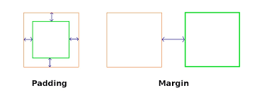
</p>

> *Note:* **Top/Bottom margins có thể thu gọn:** nếu bạn có lề 20px ở cuối một phần tử và lề 30px ở đầu phần tử tiếp theo, thì lề giữa hai phần tử sẽ là 30px hơn 50px. Điều này không áp dụng cho margin trái/phải hoặc padding.

<div align="right">
    <b><a href="#">↥ back to top</a></b>
</div>

## Q. Gradients?

CSS gradients are represented by the `<gradient>` data type, a special type of `<image>` made of a progressive transition between two or more colors. There are three types of gradients: 
* linear (created with the `linear-gradient()` function), 
* radial (created with `radial-gradient()`), and 
* conic (created with the `conic-gradient()` function).  

We can also create repeating gradients with the `repeating-linear-gradient()`, `repeating-radial-gradient()`, and `repeating-conic-gradient()` functions.
```css
/* Example - 01: A basic linear gradient */
.simple-linear {
  background: linear-gradient(blue, pink);
}

/* Example - 02: Changing the direction */
.horizontal-gradient {
  background: linear-gradient(to right, blue, pink);
}

/* Example - 03: Diagonal gradients */
.diagonal-gradient {
  background: linear-gradient(to bottom right, blue, pink);
}

/* Example - 04: Using angles */
.angled-gradient {
  background: linear-gradient(70deg, blue, pink);
}

/* Example - 05: Creating hard lines */
.striped { 
   background: linear-gradient(to bottom left, cyan 50%, palegoldenrod 50%); 
}
```
<div align="right">
    <b><a href="#">↥ back to top</a></b>
</div>

## Q. Opacity

<p align="center">
  
</p>

Thuộc tính CSS `opacity` thiết lập độ mờ của một phần tử. Độ mờ là mức độ ẩn nội dung đằng sau một phần tử và ngược lại với độ trong suốt.

```css
div { background-color: lightblue; }
.light {
  opacity: 30%; /* Barely see the text over the background */
}
.medium {
  opacity: 60%; /* See the text more clearly over the background */
}
.heavy {
  opacity: 100%; /* See the text very clearly over the background */
}
```

```html
<div class="light">You can barely see this.</div>
<div class="medium">This is easier to see.</div>
<div class="heavy">This is very easy to see.</div>
```

<div align="right">
    <b><a href="#">↥ back to top</a></b>
</div>

## Q. Inherit

Kế thừa là khái niệm trong đó lớp con sẽ kế thừa các thuộc tính của lớp cha. Nó được sử dụng trong CSS để xác định thứ bậc từ cấp cao nhất đến cấp dưới cùng. Các thuộc tính được kế thừa có thể bị lớp con ghi đè nếu lớp con sử dụng cùng tên.

**Example:**

```css
span {
  color: blue;
  border: 1px solid black;
}
.extra span {
  color: inherit;
}
```

<div align="right">
    <b><a href="#">↥ back to top</a></b>
</div>

## Q. Sự khác biệt về trình duyệt trong cơ sở người dùng?

Truy vấn `@supports` trong CSS có thể rất hữu ích để quét xem trình duyệt hiện tại của người dùng có một tính năng nhất định hay không. Quy tắc CSS `@supports` cho phép bạn chỉ định các khai báo phụ thuộc vào sự hỗ trợ của trình duyệt đối với một hoặc nhiều tính năng CSS cụ thể. Đây được gọi là truy vấn tính năng. Quy tắc có thể được đặt ở cấp cao nhất trong mã của bạn hoặc được lồng bên trong bất kỳ quy tắc nhóm có điều kiện nào khác.

```css
@supports (display: grid) {
  div {
    display: grid;
  }
}

@supports not (display: grid) {
  div {
    float: right;
  }
}
```

<div align="right">
    <b><a href="#">↥ back to top</a></b>
</div>

## Q. Cascade

Xếp tầng (Cascade) là một phương pháp xác định trọng số (tầm quan trọng) của các quy tắc tạo kiểu riêng lẻ, do đó cho phép sắp xếp các quy tắc xung đột nếu các quy tắc đó áp dụng cho cùng một bộ chọn.

```css
P {color: white ! important} /* increased weight */
P (color: black} /* normal weight */
```

<div align="right">
    <b><a href="#">↥ back to top</a></b>
</div>

## Q. Tiền tố của nhà cung cấp CSS

Tiền tố của nhà cung cấp là phần mở rộng cho các tiêu chuẩn CSS có thể được thêm vào các tính năng này để ngăn chặn sự không tương thích phát sinh khi tiêu chuẩn được mở rộng. Tiền tố của nhà cung cấp CSS cho một số nền tảng phổ biến được liệt kê bên dưới.

* **-webkit-**: Android, Chrome, iOS, and Safari
* **-moz-**: Mozilla Firefox
* **-ms-**: Internet Explorer
* **-o-**: Opera

<div align="right">
    <b><a href="#">↥ back to top</a></b>
</div>

## Q. DOM (Document Object Model)?

Document Object Model (DOM) là giao diện lập trình cho các tài liệu HTML và XML (Ngôn ngữ đánh dấu mở rộng). Nó xác định cấu trúc logic của tài liệu và cách tài liệu được truy cập và thao tác. Tài liệu này cho phép Javascript truy cập và thao tác các thành phần và kiểu của trang web. Mô hình được xây dựng theo cấu trúc cây của các đối tượng và xác định:

* Các phần tử HTML dưới dạng đối tượng
* Thuộc tính của tất cả các phần tử HTML
* Các phương pháp truy cập tất cả các phần tử HTML
* Các sự kiện cho tất cả các phần tử HTML

<p align="center">
  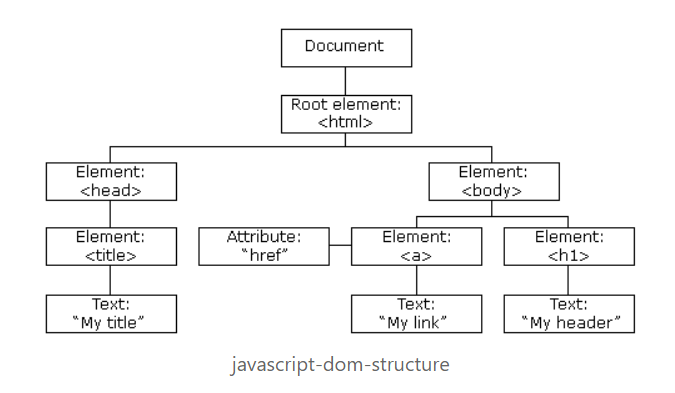
</p>

**DOM Document**

DOM Document là chủ sở hữu của tất cả các đối tượng khác trong trang web của bạn. Điều đó có nghĩa là nếu bạn muốn truy cập bất kỳ đối tượng nào trên trang web của mình, bạn luôn phải bắt đầu với tài liệu. Nó cũng chứa nhiều thuộc tính và phương thức quan trọng cho phép chúng tôi truy cập và sửa đổi trang web của mình.

**Finding HTML Elements**

|Phương pháp           |Mô tả |
|------------------|-----------------|
|getElementById()  |Phương pháp này được sử dụng để lấy một phần tử duy nhất theo ID của nó.|
|getElementsByClassName() |Phương pháp này trả về một mảng các phần tử.      |
|getElementsByTagName()   |Phương pháp này được sử dụng để lấy một phần tử duy nhất theo tên thẻ của nó|
|querySelector()          |Phương pháp này trả về phần tử đầu tiên khớp với trình chọn CSS đã xác định. Nó có thể lấy các phần tử theo ID, lớp, thẻ và tất cả các trình chọn CSS hợp lệ khác.|
|querySelectorAll()       |Phương pháp này hoàn toàn giống như querySelector() ngoại trừ việc nó trả về tất cả các phần tử phù hợp với Trình chọn CSS.|

**Thay đổi HTML Elements**

Thuộc tính `InnerHTML` có thể được sử dụng để thay đổi nội dung của phần tử HTML. Trong ví dụ này, chúng ta lấy phần tử có `id` là tiêu đề và đặt nội dung bên trong thành `"Hello World!"`.

```js
// Example: Using text
document.getElementById("#header").innerHTML = "Hello World!";

// Example: Using text with tag
document.getElementsByTagName("div").innerHTML = "<h1>Hello World!</h1>"
```

**Thay đổi giá trị của thuộc tính**

Chúng ta cũng có thể thay đổi giá trị của một thuộc tính bằng DOM.

```js
document.getElementsByTag("img").src = "image.jpg";
```

**Thay đổi style css**

Để thay đổi kiểu của một phần tử HTML, chúng ta cần thay đổi thuộc tính style của các phần tử. Thuộc tính CSS cần được viết bằng chữ `camelcase` thay vì tên thuộc tính css thông thường.

```js
document.getElementsByTag("h1").style.borderBottom = "solid 3px #000";
```

**Thêm và xóa các elements**

**Thêm elements**

tạo một phần tử div bằng phương thức `createElement()` lấy tên thẻ làm tham số và lưu nó vào một biến. Sau đó, chúng ta chỉ cần cung cấp cho nó một số nội dung rồi chèn nó vào tài liệu DOM của mình.

```js
var div = document.createElement("div");

var newContent = document.createTextNode("Hello World!"); 
div.appendChild(newContent);
document.body.insertBefore(div, currentDiv);
```

Ở đây, chúng tôi tạo nội dung bằng phương thức `createTextNode()` lấy Chuỗi làm tham số và sau đó chúng tôi chèn phần tử div mới trước div đã tồn tại trong tài liệu của chúng tôi.

**Xoá elements**

Ở đây chúng ta lấy một phần tử và xóa nó bằng phương thức `removeChild()`.

```js
var elem = document.querySelector('#header');
elem.parentNode.removeChild(elem);
```

**Thay thế elements**

```js
var div = document.querySelector('#div');
var newDiv = document.createElement('div');

newDiv.innerHTML = "Hello World2";
div.parentNode.replaceChild(newDiv, div);
```

Ở đây chúng ta thay thế một phần tử bằng phương thức `replaceChild()`. Đối số đầu tiên là phần tử mới và đối số thứ hai là phần tử mà chúng ta muốn thay thế.

**Viết trực tiếp vào luồng đầu ra HTML**

Chúng ta cũng có thể viết trực tiếp các biểu thức HTML và JavaScript vào luồng đầu ra HTML bằng phương thức `write()`. Phương thức `write()` cũng có thể nhận nhiều đối số sẽ được thêm vào tài liệu theo thứ tự xuất hiện của chúng.

```js
// HTML Content
document.write("<h1>Hello World!</h1><p>This is a paragraph!</p>");

// date object
document.write(Date());
```

**Event Handlers**

HTML DOM cũng cho phép Javascript phản ứng với các sự kiện HTML. ví dụ: nhấp chuột, tải trang, di chuyển chuột, thay đổi trường nhập, v.v.

**Chỉ định Events**

Bạn có thể xác định sự kiện trực tiếp trong mã js của mình. Dưới đây là ví dụ về sự kiện onclick:

```js
document.getElementById("btn").onclick = changeText();
```

**Chỉ định Events Listeners**

Ở đây chúng ta vừa chỉ định một clickevent gọi phương thức `runEvent` khi phần tử `btn` của chúng ta được nhấp vào.

```js
document.getElementById("btn").addEventListener('click', runEvent);
```

**Node Relationships**

Các node trong Tài liệu DOM có mối quan hệ phân cấp với nhau. Điều này có nghĩa là các node có cấu trúc giống như một cái cây. Chúng tôi sử dụng các thuật ngữ cha mẹ, anh chị em và con cái để mô tả mối quan hệ giữa các node.

node trên cùng được gọi là node gốc và là node duy nhất không có node cha. Thẻ gốc trong một tài liệu HTML thông thường là thẻ `<html/>` vì nó không có thẻ cha và là thẻ trên cùng của tài liệu.

**Navigating Giữa Nodes**

Chúng ta có thể điều hướng giữa các nút bằng các thuộc tính sau:

* parentNode
* childNodes
* firstChild
* lastChild
* nextSibling

**Example:**

```js
var parent = document.getElementById("heading").parentNode
```

<div align="right">
    <b><a href="#">↥ back to top</a></b>
</div>

## Q. Thuộc tính "table-layout"?

Thuộc tính CSS **table-layout** đặt thuật toán được sử dụng để bố trí các cells, rows, and columns `<table>`.

**Cú pháp**

```css
table-layout: auto|fixed|initial|inherit;
```

**Property Values**

|Giá trị          |Mô tả          |
|---------------|---------------------|
|auto:          |Được sử dụng để đặt bố cục bảng tự động trên trình duyệt. Thuộc tính này đặt chiều rộng cột theo nội dung không thể phá vỡ trong các ô.|
|fixed:         |Được sử dụng để đặt bố cục bảng cố định. Chiều rộng bảng và cột được đặt theo chiều rộng của bảng và col hoặc theo chiều rộng của hàng đầu tiên của các ô. Các ô ở các hàng khác không ảnh hưởng đến chiều rộng cột. Nếu không có chiều rộng nào trên hàng đầu tiên, chiều rộng cột sẽ được chia đều trên bảng theo nội dung của bảng.|
|initial:       |Được sử dụng để đặt giá trị mặc định của nó.|
|inherit:       |Được sử dụng để kế thừa thuộc tính từ phần tử cha của nó.|

**Example:**

```html
<!DOCTYPE html>
<html>
  <head>
      <title>table-layout Property</title>
    <style>
      table {
        width: 100%; 
        table-layout: fixed;       
        border-collapse: collapse;
      } 

      th, td {
        padding: 8px;
        border: 1px solid #dee2e6;
      }

      th {
        height: 40px;
        text-align: left;
      }
    </style>
  </head>
<body>
<h2>table-layout Property</h2>
<table>
    <thead>
        <tr>
            <th>Row</th>
            <th>First Name</th>
            <th>Last Name</th>
            <th>Email</th>
        </tr>
    </thead>
    <tbody>
        <tr>
            <td>1</td>
            <td>Clark</td>
            <td>Kent</td>
            <td>clarkkent@mail.com</td>
        </tr>
        <tr>
            <td>2</td>
            <td>John</td>
            <td>Carter</td>
            <td>johncarter@mail.com</td>
        </tr>
        <tr>
            <td>3</td>
            <td>Peter</td>
            <td>Parker</td>
            <td>peterparker@mail.com</td>
        </tr>            
    </tbody>
</table>
</body>
</html>
```

> *Lưu ý: Lợi ích chính của `table-layout: fixed;` là bảng hiển thị nhanh hơn nhiều. Trên các bảng lớn, người dùng sẽ không nhìn thấy bất kỳ phần nào của bảng cho đến khi trình duyệt hiển thị toàn bộ bảng. Vì vậy, nếu bạn sử dụng `table-layout: fix`, người dùng sẽ thấy phần đầu của bảng trong khi trình duyệt tải và hiển thị phần còn lại của bảng. Điều này tạo ấn tượng rằng trang tải nhanh hơn rất nhiều!*

<div align="right">
    <b><a href="#">↥ back to top</a></b>
</div>


## Q. Calc()

Hàm `calc()` có thể được sử dụng để thực hiện các phép tính cộng, trừ, nhân và chia với các giá trị thuộc tính số. Cụ thể, nó có thể được sử dụng với các loại dữ liệu `<length>`, `<tần số>`, `<angle>`, `<time>`, `<number>` hoặc `<integer>`.

**Example:**

```css
/* Example - 1 */
.main-content {
  width: calc(100vh - 10px); /* Subtract 10px from 100vh */
}

/* Example - 2 */
.container {
  padding: calc(1vw + 1em);
  width: calc(var(--variable-width) + 200px);
  transform: rotate( calc(1turn + 28deg) );
  background: hsl(100, calc(3 * 20%), 40%);
  font-size: calc(50vw / 3);
  border-radius: 15px calc(15px / 3) 4px 2px;
}
```

<div align="right">
    <b><a href="#">↥ back to top</a></b>
</div>

## Q. Variables 

Thuộc tính tùy chỉnh (đôi khi được gọi là **Variables CSS** hoặc **cascading variables**) là các thực thể do tác giả CSS xác định và chứa các giá trị cụ thể sẽ được sử dụng lại trong toàn bộ tài liệu. Chúng được thiết lập bằng ký hiệu thuộc tính tùy chỉnh (ví dụ: `--main-color: black;`) và được truy cập bằng hàm `var()` (ví dụ: `color: var(--main-color);`).

Tên thuộc tính có tiền tố `--`, như `--example-name`, biểu thị các thuộc tính tùy chỉnh chứa một giá trị có thể được sử dụng trong các khai báo khác bằng cách sử dụng hàm `var()`.

**Cú pháp**

```css
--somekeyword: left;
--somecolor: #0000ff;
--somecomplexvalue: 3px 6px rgb(20, 32, 54);
```

**Example:**

```css
:root {
  --first-color: #16f;
  --second-color: #ff7;
}

#firstParagraph {
  background-color: var(--first-color);
  color: var(--second-color);
}

#secondParagraph {
  background-color: var(--second-color);
  color: var(--first-color);
}

#container {
  --first-color: #290;
}

#thirdParagraph {
  background-color: var(--first-color);
  color: var(--second-color);
}
```

```html
<p id="firstParagraph">This paragraph should have a blue background and yellow text.</p>
<p id="secondParagraph">This paragraph should have a yellow background and blue text.</p>
<div id="container">
  <p id="thirdParagraph">This paragraph should have a green background and yellow text.</p>
</div>
```

**Live Demo**: [Custom Properties Variables](https://learning-zone.github.io/css-interview-questions/assets/files/custom-properties.html)

<div align="right">
    <b><a href="#">↥ back to top</a></b>
</div>

## Q. Sự khác biệt giữa các biến CSS và các biến tiền xử lý (SASS, LESS, Stylus) là gì?

Các biến SASS được thay thế bằng các giá trị của chúng vì bộ tiền xử lý tạo ra đầu ra CSS của nó rất lâu trước khi trình duyệt diễn giải mã, trong khi các thuộc tính tùy chỉnh CSS được trình duyệt đánh giá trong thời gian chạy.

**Example:** Preprocessor Variable

```css
$brandColor: #F06D06;

.main-header {
  color: $brandColor;
}
.main-footer {
  background-color: $brandColor;
}
```

Đoạn mã trên sẽ không làm gì trong trình duyệt. Trình duyệt sẽ không hiểu các khai báo và loại bỏ chúng. Bộ tiền xử lý cần biên dịch thành CSS để sử dụng. Mã này sẽ biên dịch thành:

```css
.main-header {
  color: #F06D06;
}
.main-footer {
  background-color: #F06D06;
}
```

Đây hiện là CSS hợp lệ. Biến này là một phần của ngôn ngữ tiền xử lý, không phải bản thân CSS. Khi mã được biên dịch, các biến sẽ biến mất.

**Example:** CSS Custom Property

CSS gốc đã bắt đầu hỗ trợ các biến CSS hoặc "Thuộc tính tùy chỉnh CSS". Nó cho phép bạn làm việc trực tiếp với các biến trong CSS. Không có biên dịch.

```css
:root {
  --main-color: #F06D06;
}

.main-header {
  color: var(--main-color);
}
.main-footer {
  background-color: var(--main-color);
}
```

<div align="right">
    <b><a href="#">↥ back to top</a></b>
</div>

## Q. Vendor-Prefixes

Vendor-Prefixes CSS, đôi khi còn được gọi là CSS browser prefixes, là một cách để các nhà sản xuất trình duyệt bổ sung hỗ trợ cho các tính năng CSS mới trước khi các tính năng đó được hỗ trợ đầy đủ trong tất cả các trình duyệt.

**Example:** thuộc tính `transition`

```css
.myClass {
	-webkit-transition: all 1s linear;
	-moz-transition: all 1s linear;
	-ms-transition: all 1s linear;
	-o-transition: all 1s linear;
	transition: all 1s linear;
}
```

**CSS prefixes**

Các trình duyệt chính sử dụng các tiền tố sau:

* `-webkit-` (Chrome, Safari, các phiên bản Opera mới hơn, hầu hết tất cả các trình duyệt iOS bao gồm Firefox cho iOS; về cơ bản là mọi trình duyệt dựa trên WebKit)
* `-moz-` (Firefox)
* `-o-` (phiên bản Opera tiền WebKit cũ)
* `-ms-` (Internet Explorer và Microsoft Edge)

<div align="right">
    <b><a href="#">↥ back to top</a></b>
</div>

## Q. Image-scroll

Thuộc tính **background-attachment** trong CSS được sử dụng để chỉ định loại tệp đính kèm của hình nền đối với vùng chứa của nó. Nó có thể được thiết lập để cuộn hoặc vẫn cố định. Nó có thể được áp dụng cho tất cả các phần tử HTML.

**Syntax**

```css
background-attachment: scroll|fixed|local|initial|inherit;
```

**Property Values**

|Giá trị	      |Mô tả|
|-------------|-------------------------------------------------------|
|scroll	      |Hình ảnh nền sẽ cuộn cùng với trang. Đây là mặc định|
|fixed	      |Hình ảnh nền sẽ không cuộn cùng với trang|
|local	      |Hình ảnh nền sẽ cuộn cùng với nội dung của phần tử|
|initial	    |Thiết lập thuộc tính này về giá trị mặc định của nó. (Tham khảo về initial)|
|inherit	    |Kế thừa thuộc tính này từ phần tử cha của nó. (Tham khảo về inherit)|

**Example:**

```html
<!DOCTYPE html>
<html>
  <head>
    <style>
      body {
        background-image: url("../images/img_tree.gif");
        background-repeat: no-repeat;
        background-attachment: fixed;
      }
    </style>
  </head>
<body>
  <h1>The background-attachment Property</h1>

  <p>The background-image is fixed. Try to scroll down the page.</p>
    ...
  <p>If you do not see any scrollbars, try to resize the browser window.</p>
</body>
</html>
```


<div align="right">
    <b><a href="#">↥ back to top</a></b>
</div>

## Q. Overflow

Thuộc tính tràn CSS chỉ định cách xử lý nội dung khi nó tràn vùng chứa cấp khối.

**Syntax**

```css
overflow: visible|hidden|scroll|auto|initial|inherit;
```

**Property Values**

|Giá trị	   |Mô tả	|
|--------- |--------------------------------|
|visible	 |Overflow không bị cắt. Nó hiển thị bên ngoài hộp của phần tử.                |	
|hidden	   |Overflow bị cắt và phần còn lại của nội dung sẽ không hiển thị          |
|scroll	   |Overflow bị cắt, nhưng một thanh cuộn được thêm vào để xem phần còn lại của nội dung	|
|auto	     |Nếu overflow bị cắt, một thanh cuộn nên được thêm vào để xem phần còn lại của nội dung|	
|initial	 |Thiết lập thuộc tính này về giá trị mặc định của nó.|
|inherit	 |Kế thừa thuộc tính này từ phần tử cha của nó.|
|overflow-x|Chỉ định cách xử lý các cạnh trái/phải của nội dung nếu nó tràn ra khỏi khu vực nội dung của phần tử|
|overflow-y|Chỉ định cách xử lý các cạnh trên/dưới của nội dung nếu nó tràn ra khỏi khu vực nội dung của phần tử|

**Example:**

```html
<!DOCTYPE html>
<html>
  <head>
    <title>CSS Overflow Property</title>
    <style>
      div {
        background-color: #eee;
        width: 200px;
        height: 100px;
        border: 1px dotted black;
        overflow: scroll;
        padding: 10px;
      }
    </style>
  </head>
<body>
  <h2>CSS Overflow Property</h2>
  <p>Setting the overflow value to scroll, the overflow is clipped and a scrollbar
     is added to scroll inside the box.
  </p>

  <div>You can use the overflow property when you want to have better control of 
    the layout. The overflow property specifies what happens if content overflows 
    an element's box.
  </div>
</body>
</html>
```

<div align="right">
    <b><a href="#">↥ back to top</a></b>
</div>

## Q. Word-wrapping

Thuộc tính `word-wrap` trong CSS được sử dụng để ngắt từ dài và ngắt dòng sang dòng tiếp theo. Nó xác định xem có ngắt các từ hay không khi nội dung vượt quá ranh giới của vùng chứa nó.

**Syntax**

```css
word-wrap: normal|break-word|initial|inherit;
```

**Property Values**

|Giá trị	   |Mô tả	|
|-------------|----------------------------------|
|normal	      |Chỉ ngắt từ tại các điểm ngắt cho phép|
|break-word	  |Cho phép ngắt các từ không thể ngắt|
|initial	    |Thiết lập thuộc tính này về giá trị mặc định của nó|
|inherit	    |Kế thừa thuộc tính này từ phần tử cha của nó|

**Example:**

```html
<!DOCTYPE html>
<html>
<head>
    <title>The word-wrap Property</title>
    <style>
        div {
            width: 150px;
            border: 1px solid #333;
        }

        div.a {
            word-wrap: normal;
        }

        div.b {
            word-wrap: break-word;
        }
    </style>
</head>
<body>
    <h1>The word-wrap Property</h1>

    <h2>word-wrap: normal (default):</h2>
    <div class="a"> This div contains a very long word: thisisaveryveryveryveryveryverylongword. 
      The long word will break and wrap to the next line.</div>

    <h2>word-wrap: break-word:</h2>
    <div class="b"> This div contains a very long word: thisisaveryveryveryveryveryverylongword. 
      The long word will break and wrap to the next line.</div>
</body>
</html>
```

<div align="right">
    <b><a href="#">↥ back to top</a></b>
</div>


## Q. CSS hoạt động cơ bản như thế nào?

Ngôn ngữ CSS được thiết kế để sử dụng cùng với ngôn ngữ "đánh dấu" như HTML. CSS xác định cách các phần tử HTML được định dạng - kiểm soát bố cục, màu sắc, phông chữ, v.v. Khi trình duyệt hiển thị một tài liệu, nó phải kết hợp nội dung của tài liệu với thông tin kiểu của nó. Nó xử lý tài liệu theo một số giai đoạn, chúng tôi đã liệt kê dưới đây.

1.Trình duyệt tải HTML (ví dụ: nhận nó từ mạng).
2. Nó chuyển đổi HTML thành DOM (Mô hình đối tượng tài liệu).
3. Sau đó, trình duyệt sẽ truy cập hầu hết các tài nguyên được liên kết đến bởi tài liệu HTML, chẳng hạn như ảnh nhúng, video và CSS được liên kết.
4. Trình duyệt phân tích CSS được truy cập và sắp xếp các quy tắc khác nhau theo các loại trình chọn của chúng thành các "thùng" khác nhau, ví dụ: phần tử, lớp, ID, v.v. Dựa trên các trình chọn tìm thấy, nó sẽ xác định các quy tắc nào nên được áp dụng cho các nút nào trong DOM và gắn kiểu cho chúng khi cần thiết (bước trung gian này được gọi là cây kết xuất).
5. Cây kết xuất được bố trí theo cấu trúc mà nó sẽ xuất hiện sau khi các quy tắc đã được áp dụng cho nó.
6. Màn hình hiển thị trực quan của trang được hiển thị trên màn hình (giai đoạn này được gọi là vẽ tranh).


Sơ đồ sau đây cũng cung cấp một cái nhìn đơn giản về quy trình.

<p align="center">
  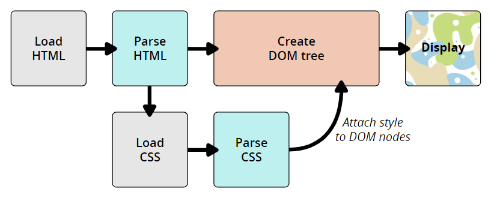
</p>

**DOM và CSSOM:**

DOM có cấu trúc dạng cây. Mỗi phần tử, thuộc tính và mẩu văn bản trong ngôn ngữ đánh dấu sẽ trở thành một nút DOM trong cấu trúc cây. Các nút được xác định bởi mối quan hệ của chúng với các nút DOM khác. Một số phần tử là cha của các nút con và các nút con có các anh chị em. Trình duyệt trải qua một quá trình bao gồm chuyển đổi, phân tích token, lexing và phân tích cú pháp, cuối cùng tạo ra DOM và CSSOM.

* **Conversion**: Đọc các byte thô của HTML và CSS từ đĩa hoặc mạng.
* **Tokenization**: Chia đầu vào thành các phần nhỏ (ví dụ: thẻ bắt đầu, thẻ kết thúc, tên thuộc tính, giá trị thuộc tính), loại bỏ các ký tự không liên quan như dấu cách và ngắt dòng.
* **Lexing**: Giống như tokenizer, nhưng nó cũng xác định loại của mỗi token (token này là một số, token đó là một chuỗi ký tự, token khác này là toán tử bằng).
* **Parsing**: Lấy luồng các token từ trình phân tích lexing, diễn giải các token bằng cách sử dụng ngữ pháp cụ thể và biến nó thành cây cú pháp trừu tượng.


**Example:** Diễn tả DOM

```html
<p>
  Let's use:
  <span>Cascading</span>
  <span>Style</span>
  <span>Sheets</span>
</p>
````

Trong DOM, node tương ứng với phần tử `<p>` của chúng ta là node cha. Các node con của nó là một node văn bản và ba node tương ứng với các phần tử `<span>` của chúng ta. Các node SPAN cũng là node cha, với các node văn bản là node con:

```html
P
├─ "Let's use:"
├─ SPAN
|  └─ "Cascading"
├─ SPAN
|  └─ "Style"
└─ SPAN
   └─ "Sheets"
```

Áp dụng CSS cho DOM

```css
span {
  border: 1px solid black;
  background-color: lime;
}
```

Sau khi cả hai cấu trúc cây được tạo, công cụ kết xuất sau đó gắn các cấu trúc dữ liệu vào cái được gọi là cây kết xuất như một phần của quá trình bố cục. Cây kết xuất là biểu diễn trực quan của tài liệu cho phép vẽ nội dung của trang theo đúng thứ tự.

Việc xây dựng cây kết xuất tuân theo thứ tự sau:

* Bắt đầu từ gốc của cây DOM, duyệt qua từng nút có thể nhìn thấy.
* Bỏ qua các nút không nhìn thấy.
* Đối với mỗi nút có thể nhìn thấy, hãy tìm các quy tắc CSSOM phù hợp tương ứng và áp dụng chúng.
* Phát ra các nút có thể nhìn thấy có nội dung và các kiểu được tính toán của chúng.
* Cuối cùng, tạo ra một cây kết xuất chứa cả nội dung và thông tin kiểu của tất cả nội dung có thể nhìn thấy trên màn hình.


<div align="right">
    <b><a href="#">↥ back to top</a></b>
</div>
